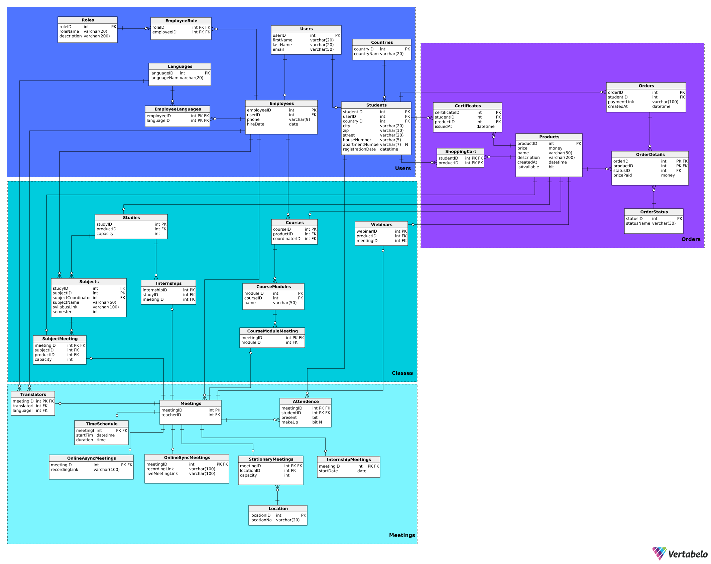

# Podstawy Baz Danych - Projekt 2024/2025

Projekt realizowany w ramach przedmiotu Podstawy Baz Danych na kierunku Informatyka na AGH.

## Zespół

- Jakub Fabia
- Seweryn Tasior
- Mariusz Krause

## Schemat bazy danych



# Dokumentacja

1. **[Funkcje systemu](#funkcje-systemu)**
2. **[Opis tabel, relacji, warunków integralnościowych](#opis-tabel-relacji-warunków-integralnościowych)**
    * [Kategoria Users](#kategoria-users)
    * [Kategoria Orders](#kategoria-orders)
    * [Kategoria Meetings](#kategoria-meetings)
    * [Kategoria Classes](#kategoria-classes)
3. [**Tworzenie danych**](#tworzenie-danych---jakub-fabia)
4. [**Widoki**](#widoki)
5. [**Procedury**](#procedury)
6. [**Funkcje**](#funkcje)
7. [**Triggery**](#triggery)
8. [**Indeksy**](#indeksy)
9. [**Role**](#role)


# Funkcje Systemu

## Użytkownicy i zarządzanie kontami
- Rejestracja konta uczestnika - Gość
- Usuwanie konta uczestnika - Administrator, Uczestnik
- Edycja danych profilu - Uczestnik
- Zakładanie i dezaktywacja konta tłumacza, wykładowcy, koordynatora - Administrator
- Dodawanie i usuwanie pracowników sekretariatu, administratora - Dyrektor

## Koszyk i płatności
- Dodawanie/Usuwanie produktów do koszyka - Uczestnik
- Obliczanie wartości koszyka - System
- Składanie zamówienia (w całości / zaliczki) - Uczestnik
- Dopłata całości kwoty - Uczestnik
- Generowanie linku płatności - System
- Rejestracja płatności (udana/nieudana) - System
- Wysłanie powiadomienia o zaległościach - System

## Webinary
- Dodawanie nowego webinaru, przypisanie wykładowcy - Planista
- Przeglądanie listy webinarów - Gość
- Dostęp do szczegółów webinaru (na żywo / zapisu) - Zapisany uczestnik
- Modyfikacja webinaru - Wykładowca
- Usuwanie webinaru - Administrator
- Zapis uczestnika na webinar - System
- Przypisanie tłumacza do webinaru - Wykładowca
- Umożliwienie dostępu bez opłaty - Dyrektor
- Dodawanie tłumaczenia do webinaru - Tłumacz

## Kursy
- Dodawanie nowego kursu, przypisanie koordynatora  - Planista
- Przeglądanie listy kursów i ich modułów - Gość
- Dostęp do szczegółowych danych kursu - Zapisany uczestnik
- Modyfikacja kursu i jego modułów - Koordynator
- Modyfikacja harmonogramu kursu - Pracownik sekretariatu
- Usuwanie kursu - Administrator
- Przypisanie tłumacza do kursu - Planista
- Dodawanie tłumaczenia do kursu - Tłumacz
- Zapis na kurs - System
- Zaliczanie modułów i kursów - System
- Sprawdzanie obecności na zajęciach - Wykładowca
- Generowanie dyplomów ukończenia kursów - Pracownik sekretariatu

## Studia
- Dodawanie nowych studiów i ich modułów, przypisanie koordynatora - Planista
- Przeglądanie szczegółów studiów i modułów - Gość
- Modyfikacja danych studiów - Pracownik sekretariatu
- Zapis na studia - System
- Zapis na pojedynczy zjazd - System
- Dostęp do szczegółowych danych zajęć zdalnych - Zapisany uczestnik
- Sprawdzanie obecności na zajęciach - Wykładowca
- Generowanie dyplomów ukończenia studiów - Pracownik sekretariatu
- Przypisanie tłumacza do studiów - Planista
- Obliczanie dostępnej liczby miejsc na studia - System
- Wskazanie możliwości odrobienia nieobecności - Wykładowca
- Wprowadzanie danych odnośnie praktyk - Wykładowca

## Raporty
- Generowanie raportu przychodów (webinary, kursy, studia) - Księgowy
- Generowanie listy dłużników - Księgowy
- Generowanie liczby zapisanych uczestników na wydarzenia - Koordynator, Planista
- Generowanie raportu frekwencji na zakończonych wydarzeniach - Koordynator, Wykładowca, Planista
- Generowanie listy obecności z datami i szczegółami - Koordynator, Wykładowca, Planista
- Generowanie raportu kolizji zapisów uczestników - Planista

## Pozostałe funkcje
- Automatyczne backupy danych - System
- Backup na żądanie - Administrator
- Odtwarzanie danych z backupów - Administrator
- Wysyłanie przypomnień o płatnościach - System
- Wprowadzanie potwierdzenia odbioru/wysłania dyplomu - Pracownik sekretariatu

# Opis tabel, relacji, warunków integralnościowych

## Kategoria Users

### Tabela Users

Tabela **Users** przechowuje podstawowe informacje o użytkownikach systemu:

- **userID** - id użytkownika (klucz główny, int)
  - autoinkrementacja: od wartości 1 , kolejna wartość większa o 1
- firstName - imię użytkownika (varchar(20))
- lastName - nazwisko użytkownika (varchar(20))
- email - adres email użytkownika (varchar(50))
  - warunek: Unikalny w formacie text@text.text

```sql
CREATE TABLE Users (
    userID int NOT NULL IDENTITY(1,1),
    firstName varchar(20) NOT NULL,
    lastName varchar(20) NOT NULL,
    email varchar(50) NOT NULL,
    CONSTRAINT unique_email UNIQUE (email),
    CONSTRAINT email_format CHECK (
        email LIKE '%_@_%._%'
    ),
    CONSTRAINT userID PRIMARY KEY (userID)
);
```

### Tabela Employees

Tabela **Employees** przechowuje informacje o pracownikach:

- **employeeID** - id pracownika (klucz główny, int)
  - autoinkrementacja: od wartości 1 , kolejna wartość większa o 1
- **userID** - id użytkownika (klucz obcy do Users, int)
- phone - numer telefonu pracownika (varchar(15))
  - warunek: Jeśli długość = 9 to wszystkie znaki muszą być cyframi (numery polskie). Jeśli jest dłuższy to na początku musi być +, a następne znaki to cyfry (kierunkowy i zagraniczne numery)
- hireDate - data zatrudnienia pracownika (date)
  - domyślnie: Dzisiejsza data
  - warunek: data między '2020-01-01', a datą dzisiejszą
- isEmployed - czy pracownik jest zatrudniony (bit)

```sql
CREATE TABLE Employees (
    employeeID int NOT NULL IDENTITY(1,1),
    userID int NOT NULL,
    phone varchar(15) NOT NULL,
    hireDate date NOT NULL DEFAULT GETDATE(),
    isEmployed bit NOT NULL DEFAULT 1,
    CONSTRAINT hireDate_Employees_reasonable CHECK (
        hireDate BETWEEN '2020-01-01' AND GETDATE()
    ),
    CONSTRAINT unique_phone UNIQUE (phone),
    CONSTRAINT valid_phone CHECK (
        (LEN(phone) = 9 AND ISNUMERIC(phone) = 1) OR
        (LEN(phone) > 9 AND LEFT(phone, 1) = '+' AND ISNUMERIC(SUBSTRING(phone, 2, LEN(phone))) = 1)
    ),
    CONSTRAINT Employees_Users FOREIGN KEY (userID) REFERENCES Users (userID),
    CONSTRAINT employeeID PRIMARY KEY (employeeID)
);
```

### Tabela Countries

Tabela **Countries** przechowuje informacje o krajach:

- **countryID** - id kraju (klucz główny, int)
  - autoinkrementacja: od wartości 1 , kolejna wartość większa o 1
- countryName - nazwa kraju (varchar(20))

```sql
CREATE TABLE Countries (
    countryID int NOT NULL IDENTITY(1,1),
    countryName varchar(20) NOT NULL,
    CONSTRAINT Countries_pk PRIMARY KEY (countryID)
);
```

### Tabela Students

Tabela **Students** przechowuje informacje o studentach:

- **studentID** - id studenta (klucz główny, int)
  - autoinkrementacja: od wartości 1 , kolejna wartość większa o 1
- **userID** - id użytkownika (klucz obcy do Users, int)
- countryID - id kraju zamieszkania (klucz obcy do Countries, int)
- city - miasto (varchar(20))
- zip - kod pocztowy (varchar(10))
- street - ulica (varchar(20))
- houseNumber - numer domu (varchar(5))
- apartmentNumber - numer mieszkania (varchar(7))
- registrationDate - data rejestracji (datetime)
  - domyślnie: data dzisiejsza
  - warunek: data rejestracji między '2020-01-01', a datą dzisiejszą

```sql
CREATE TABLE Students (
    studentID int NOT NULL IDENTITY(1,1),
    userID int NOT NULL,
    countryID int NOT NULL,
    city varchar(20) NOT NULL,
    zip varchar(10) NOT NULL,
    street varchar(20) NOT NULL,
    houseNumber varchar(5) NOT NULL,
    apartmentNumber varchar(7) NULL,
    registrationDate datetime NOT NULL DEFAULT GETDATE(),
    CONSTRAINT registrationDate_Students_reasonable CHECK (
        registrationDate BETWEEN '2020-01-01' AND GETDATE()
    ),
    CONsSTRAINT Students_Users FOREIGN KEY (userID) REFERENCES Users (userID),
    CONSTRAINT Students_Countries FOREIGN KEY (countryID) REFERENCES Countries (CountryID),
    CONSTRAINT Students_pk PRIMARY KEY (studentID)
);
```

### Tabela Languages

Tabela **Languages** przechowuje informacje o dostępnych językach wykładowych:

- **languageID** - id języka (klucz główny, int)
  - autoinkrementacja: od wartości 1 , kolejna wartość większa o 1
- languageName - nazwa języka (varchar(20))

```sql
CREATE TABLE Languages (
    languageID int NOT NULL IDENTITY(1,1),
    languageName varchar(20) NOT NULL,
    CONSTRAINT Languages_pk PRIMARY KEY (languageID)
);
```

### Tabela EmployeeLanguages

Tabela **EmployeeLanguage**s jest tabelą pomocniczą służącą do reprezentowania relacji wiele-do-wiele pomiędzy tabelami **Employee** i **Languages**:

- **employeeID** - id pracownika (klucz główny, klucz obcy do Employee, int)
- **languageID** - id języka (klucz główny, klucz obcy do Languages, int)

```sql
CREATE TABLE EmployeeLanguages (
    employeeID int NOT NULL,
    languageID int NOT NULL,
    CONSTRAINT TranslatorsLanguages_Employees FOREIGN KEY (employeeID) REFERENCES Employees (employeeID),
    CONSTRAINT Languages_TranslatorsLanguages FOREIGN KEY (languageID) REFERENCES Languages (languageID),
    CONSTRAINT EmployeeLanguages_pk PRIMARY KEY (employeeID,languageID)
);
```

### Tabela Roles

Tabela **Roles** przechowuje informacje o możliwych stanowiskach pracowniczych w systemie:

- **roleID** - id roli (klucz główny, int)
  - autoinkrementacja: od wartości 1 , kolejna wartość większa o 1
- roleName - nazwa roli (varchar(20))
- description - opis roli (varchar(200))

```sql
CREATE TABLE Roles (
    roleID int NOT NULL IDENTITY(1,1),
    roleName varchar(30) NOT NULL,
    description varchar(200) NOT NULL,
    CONSTRAINT roleID PRIMARY KEY (roleID)
);
```

### Tabela EmployeeRole

Tabela **EmployeeRole** jest tabelą pomocniczą służącą do reprezentowania relacji wiele-do-wiele pomiędzy tabelami **Employee** i **Role**. Pozwala na posiadanie wielu ról przez wielu pracowników:

- **roleID** - id roli (klucz główny, klucz obcy do Role, int)
- **employeeID** - id pracownika (klucz główny, klucz obcy do Employee, int)

```sql
CREATE TABLE EmployeeRole (
    roleID int NOT NULL,
    employeeID int NOT NULL,
    CONSTRAINT EmployeeRole_Employees FOREIGN KEY (employeeID) REFERENCES Employees (employeeID),
    CONSTRAINT EmployeeRole_Roles FOREIGN KEY (roleID) REFERENCES Roles (roleID),
    CONSTRAINT EmployeeRole_pk PRIMARY KEY (roleID,employeeID)
);
```

## Kategoria Orders

### Tabela Products

Tabela **Products** przechowuje informacje o produktach dostępnych w systemie:

- **productID** - id produktu (klucz główny, int)
  - autoinkrementacja: od wartości 1 , kolejna wartość większa o 1
- price - cena produktu (money)
    - warunek: cena większa lub równa 0
- name - nazwa produktu (varchar(50))
- description - opis produktu (varchar(200))
- createdAt - data utworzenia produktu (datetime)
  - warunek: data między '2020-01-01', a datą dzisiejszą
- isAvailable - dostępność produktu (bit)

```sql
CREATE TABLE Products (
    productID int NOT NULL IDENTITY(1,1),
    price money NOT NULL,
    name varchar(50) NOT NULL,
    description varchar(200) NOT NULL,
    createdAt datetime NOT NULL DEFAULT GETDATE(),
    isAvailable bit NOT NULL DEFAULT 1,
    CONSTRAINT createdAt_products_reasonable CHECK (
        createdAt BETWEEN '2020-01-01' AND GETDATE()
    ),
    CONSTRAINT price_nonnegative CHECK (
        price >= 0
    ),
    CONSTRAINT Products_pk PRIMARY KEY (productID)
);
```

### Tabela Certificates

Tabela **Certificates** przechowuje informacje o certyfikatach wydanych studentom:

- **certificateID** - id certyfikatu (klucz główny, int)
  - autoinkrementacja: od wartości 1 , kolejna wartość większa o 1
- **studentID** - id studenta (klucz obcy do Students, int)
- **productID** - id produktu (klucz obcy do Products, int)
- issuedAt - data wydania certyfikatu (datetime)
  - warunek: data między '2020-01-01', a datą dzisiejszą

```sql
CREATE TABLE Certificates (
    certificateID int NOT NULL IDENTITY(1,1),
    studentID int NOT NULL,
    productID int NOT NULL,
    issuedAt datetime NOT NULL,
    CONSTRAINT issuedAt_certificates_reasonable CHECK (
        issuedAt BETWEEN '2020-01-01' AND GETDATE()
    ),
    CONSTRAINT Certifactes_Products FOREIGN KEY (productID) REFERENCES Products (productID),
    CONSTRAINT Certifactes_Students FOREIGN KEY (studentID) REFERENCES Students (studentID),
    CONSTRAINT Certificates_pk PRIMARY KEY (certificateID)
);
```

### Tabela OrderStatus

Tabela **OrderStatus** przechowuje informacje o statusach każdego zamówionego przedmiotu:

- **statusID** - id statusu (klucz główny, int)
  - autoinkrementacja: od wartości 1 , kolejna wartość większa
- statusName - nazwa statusu (varchar(40))

```sql
CREATE TABLE OrderStatus (
    statusID int NOT NULL IDENTITY(1,1),
    statusName varchar(40) NOT NULL,
    CONSTRAINT OrderStatus_pk PRIMARY KEY (statusID)
);
```

### Tabela Orders

Tabela **Orders** przechowuje informacje o zamówieniach złożonych przez studentów:

- **orderID** - id zamówienia (klucz główny, int)
  - autoinkrementacja: od wartości 1 , kolejna wartość większa o 1
- **studentID** - id studenta składającego zamówienie (klucz obcy do Students, int)
- paymentLink - link do płatności (varchar(400))
  - warunek: link w formacie 'https://www.kaite.edu.pl/PaymentLink/%'
- createdAt - data utworzenia zamówienia (datetime)
  - warunek: data między '2020-01-01', a datą dzisiejszą

```sql
CREATE TABLE Orders (
    orderID int NOT NULL IDENTITY(1,1),
    studentID int NOT NULL,
    paymentLink varchar(400) NOT NULL,
    createdAt datetime NOT NULL DEFAULT GETDATE(),
    CONSTRAINT createdAt_orders_reasonable CHECK (
        createdAt BETWEEN '2020-01-01' AND GETDATE()
    ),
    CONSTRAINT valid_link_paymentLink CHECK (
        paymentLink LIKE 'https://www.kaite.edu.pl/PaymentLink/%'
    ),
    CONSTRAINT Students_Orders FOREIGN KEY (studentID) REFERENCES Students (studentID),
    CONSTRAINT Orders_pk PRIMARY KEY (orderID)
);
```

### Tabela ShoppingCart

Tabela **ShoppingCart** jest tabelą pomocniczą służącą do reprezentowania relacji wiele-do-wiele pomiędzy tabelami **Students** i **Products**. Przechowuje ona informacje o produktach w koszyku danego studenta (1 koszyk, wiele produktów):

- **studentID** - id studenta (klucz główny, klucz obcy do Students, int)
- **productID** - id produktu (klucz główny, klucz obcy do Products, int)

```sql
CREATE TABLE ShoppingCart (
    studentID int NOT NULL,
    productID int NOT NULL,
    CONSTRAINT Cart_Students FOREIGN KEY (studentID) REFERENCES Students (studentID),
    CONSTRAINT ShoppingCart_Products FOREIGN KEY (productID) REFERENCES Products (productID),
    CONSTRAINT ShoppingCart_pk PRIMARY KEY (studentID,productID)
);
```

### Tabela OrderDetails

Tabela **OrderDetails** przechowuje szczegółowe informacje o produktach w zamówieniach:

- **orderID** - id zamówienia (klucz główny, klucz obcy do Orders, int)
- **productID** - id produktu (klucz główny, klucz obcy do Products, int)
- **statusID** - id statusu zamówienia (klucz obcy do OrderStatus, int)
- **pricePaid** - kwota zapłacona za produkt (money)
    - Warunek: Nieujemna

```sql
CREATE TABLE OrderDetails (
    orderID int NOT NULL,
    productID int NOT NULL,
    statusID int NOT NULL,
    pricePaid money NOT NULL,
    CONSTRAINT order_item_price_nonnegative CHECK (
        pricePaid >= 0
    ),
    CONSTRAINT OrderItems_Orders FOREIGN KEY (orderID) REFERENCES Orders (orderID),
    CONSTRAINT OrderItems_Products FOREIGN KEY (productID) REFERENCES Products (productID),
    CONSTRAINT OrderDetails_OrderStatus FOREIGN KEY (statusID) REFERENCES OrderStatus (statusID),
    CONSTRAINT orderItemID PRIMARY KEY (orderID,productID)
);
```

## Kategoria Meetings
### Tabela Meetings
Tabela **Meetings** przechowuje informacje o spotkaniach:
- **meetingID** - id spotkania (klucz główny, int)
    - autoinkrementacja: od wartości 1 , kolejna wartość większa o 1
- teacherID - id nauczyciela prowadzącego spotkanie (klucz obcy,int)
```sql
CREATE TABLE Meetings (
    meetingID int NOT NULL IDENTITY(1,1),
    teacherID int NOT NULL,
    CONSTRAINT Meetings_Employees FOREIGN KEY (teacherID) REFERENCES Employees (employeeID),
    CONSTRAINT Meetings_pk PRIMARY KEY (meetingID)
);
```
### Tabela Attendance
Tabela **Attendance** przechowuje informacje o obecności studentów na spotkaniach.  Reprezentuje relację wiele-do-wiele pomiędzy tabelami Meetings i Students:
- **meetingID** - id spotkania (klucz główny, klucz obcy do Meetings, int)
- **studentID** - id studenta (klucz główny, klucz obcy do Students, int)
- present - status obecności studenta (bit)
    - wartość domyślna: 0 (brak obecności)
- makeUp - informacja czy zajęcia zostały odrobione (bit)
    - wartość domyślna: 0 (nie zostały odrobione)
```sql
CREATE TABLE Attendence (
    meetingID int NOT NULL,
    studentID int NOT NULL,
    present bit NOT NULL DEFAULT 0,
    makeUp bit NOT NULL DEFAULT 0,
    CONSTRAINT Attendence_Students FOREIGN KEY (studentID) REFERENCES Students (studentID),
    CONSTRAINT Meeting_Attendence FOREIGN KEY (meetingID) REFERENCES Meetings (meetingID),
    CONSTRAINT Attendence_pk PRIMARY KEY (meetingID,studentID)
);
```
### Tabela Time Schedule
Tabela **TimeSchedule** przechowuje informacje o harmonogramach spotkań (jeśli spotkanie potrzebuje harmonogramu):
- **meetingID** - id spotkania (klucz główny, klucz obcy do Meetings, int)
- startTime - czas rozpoczęcia spotkania (datetime)
    - warunek: data między '2020-01-01', a datą dzisiejszą
- duration  - czas trwannia spotkania (datetime)
    - wartość domyślna: 1 godzina 30 minut
    - warunek: czas trwania jest pomiędzy 15 minut a 4 godziny i 30 minut

```sql
CREATE TABLE TimeSchedule (
    meetingID int NOT NULL,
    startTime datetime NOT NULL,
    duration time NOT NULL DEFAULT '01:30:00',
    CONSTRAINT startTime_TimeSchedule_reasonable CHECK (
        startTime > '2020-01-01'
    ),
    CONSTRAINT duration_TimeSchedule_reasonable CHECK (
        duration BETWEEN '00:15:00' AND '04:30:00'
    ),
    CONSTRAINT TimeSchedule_Meeting FOREIGN KEY (meetingID) REFERENCES Meetings (meetingID),
    CONSTRAINT TimeSchedule_pk PRIMARY KEY (meetingID)
);
```
### Tabela Translators
Tabela **Translators** przechowuje informacje o tłumaczach na danych spotkaniach i językach ich tłumaczeń:
- **meetingID** - id spotkania (klucz główny, klucz obcy do Meetings, int)
- translatorID - id tłumacza (klucz obcy do Employees, int)
- languageID - id języka tłumaczenia (klucz obcy do Languages, int)

```sql
CREATE TABLE Translators (
    meetingID int NOT NULL,
    translatorID int NOT NULL,
    languageID int NOT NULL,
    CONSTRAINT Meeting_Translators FOREIGN KEY (meetingID) REFERENCES Meetings (meetingID),
    CONSTRAINT Employees_Translators FOREIGN KEY (translatorID) REFERENCES Employees (employeeID),
    CONSTRAINT Languages_Translators FOREIGN KEY (languageID) REFERENCES Languages (languageID),
    CONSTRAINT Translators_pk PRIMARY KEY (meetingID)
);
```
### Tabela InternshipMeetings 
Tabela **InternshipMeetings** jest tabelą do przechowywania informacji o stażach reprezentowana w relacji jeden-do-jeden z tabelą **Meetings**:
- **meetingID** - id spotkania (klucz główny, klucz obcy do Meetings, int)
- startDate - data rozpoczęcia stażu (date)
    - warunek: musi być pomiędzy 1 stycznia 2020 roku, a datą dzisiejszą

```sql
CREATE TABLE InternshipMeetings (
    meetingID int NOT NULL,
    startDate date NOT NULL,
    CONSTRAINT startDate_InternshipMeetings_reasonable CHECK (
        startDate BETWEEN '2020-01-01' AND GETDATE()
    ),
    CONSTRAINT Meetings_InternshipMeeting FOREIGN KEY (meetingID) REFERENCES Meetings (meetingID),
    CONSTRAINT InternshipMeeting_pk PRIMARY KEY (meetingID)
);
```
### Tabela OnlineSyncMeetings 
Tabela **OnlineSyncMeetings** przechowuje informacje synchronicznych spotkaniach online:
- **meetingID** - id spotkania (klucz główny, klucz obcy do Meetings, int)
- recordingLink - link do nagrania spotkania (varchar(400))
    - warunek: link musi być URl-em zaczynającym się od https://www.kaite.edu.pl/RecordingLink/
- liveMettingLink - link do spotkanie na żywo (varchar(400))
    - warunek: link musi być URl-em zaczynającym się od https://www.kaite.edu.pl/MeetingLink/


```sql
CREATE TABLE OnlineSyncMeetings (
    meetingID int NOT NULL,
    recordingLink varchar(400) NOT NULL,
    liveMeetingLink varchar(400) NOT NULL,
    CONSTRAINT valid_link_recordingLink CHECK (
        recordingLink LIKE 'https://www.kaite.edu.pl/RecordingLink/%'
    ),
    CONSTRAINT valid_link_liveMeetingLink CHECK (
        liveMeetingLink LIKE 'https://www.kaite.edu.pl/MeetingLink/%'
    ),
    CONSTRAINT OnlineSyncMeetings_Meeting FOREIGN KEY (meetingID) REFERENCES Meetings (meetingID),
    CONSTRAINT OnlineSyncMeetings_pk PRIMARY KEY (meetingID)
);
```
### Tabela OnlineAsyncMeetings 
Tabela **OnlineAsyncMeetings** przechowuje informacje o asynchronicznych spotkaniach online:
- **meetingID** - id spotkania (klucz główny, klucz obcy do Meetings, int)
- recordingLink - link do nagrania spotkania (varchar(400))
    - warunek: link musi być URl-em zaczynającym się od https://www.kaite.edu.pl/RecordingLink/
```sql
CREATE TABLE OnlineAsyncMeetings (
    meetingID int NOT NULL,
    recordingLink varchar(400) NOT NULL,
    CONSTRAINT valid_recording_link CHECK (
        recordingLink LIKE 'https://www.kaite.edu.pl/RecordingLink/%'
    ),
    CONSTRAINT OnlineAsyncMeetings_Meeting FOREIGN KEY (meetingID) REFERENCES Meetings (meetingID),
    CONSTRAINT OnlineAsyncMeetings_pk PRIMARY KEY (meetingID)
);
```
### Tabela Location 
Tabela **Location** przechowuje informacje o możliwych lokalizacjach spotkań:
- **locationID** - id lokalizacji (klucz główny, int)
- location - nazwa lokalizacji lub adres (varchar(20))

```sql
CREATE TABLE Location (
    locationID int NOT NULL,
    locationName varchar(20) NOT NULL,
    CONSTRAINT Location_pk PRIMARY KEY (locationID)
);
```
### Tabela StationaryMeetings 
Tabela **StationaryMeetings** przechowuje informacje o stacjonarnych spotkaniach:
- **meetingID** - id spotkania (klucz główny, klucz obcy do Meetings, int)
- locationID - id lokalizacji (klucz obcy do Location, int)
- capacity - pojemność sali lub liczba dostępnych miejsc (int)
    - wartość domyślna: 25
    - warunek: wartość większa od 0

```sql
CREATE TABLE StationaryMeetings (
    meetingID int NOT NULL,
    locationID int NOT NULL,
    capacity int NOT NULL DEFAULT 25,
    CONSTRAINT capacity_positive CHECK (
        capacity > 0
    ),
    CONSTRAINT StationaryMeetings_Meeting FOREIGN KEY (meetingID) REFERENCES Meetings (meetingID),
    CONSTRAINT StationaryMeetings_Location FOREIGN KEY (locationID) REFERENCES Location (locationID),
    CONSTRAINT StationaryMeetings_pk PRIMARY KEY (meetingID)
);
```

## Kategoria Classes

### Tabela Courses
Tabela **Courses** przechowuje informacje o kursach:
- **courseID** - id kursu (klucz główny, int)
    - autoinkrementacja: od wartości 1 , kolejna wartość większa o 1
- productID - id produktu (klucz obcy do Products, int)
- coordinatorID - id koordynatora kursu (klucz obcy do Employees, int)
- capacity - ilość miejsc w kursie (int, nullable)
    - warunek: capacity większe od 0

```sql
CREATE TABLE Courses (
    courseID int NOT NULL IDENTITY(1,1),
    productID int NOT NULL,
    coordinatorID int NOT NULL,
    capacity int,
    CONSTRAINT Courses_capacity_positive CHECK (
        capacity > 0
    ),
    CONSTRAINT Courses_Products FOREIGN KEY (productID) REFERENCES Products (productID),
    CONSTRAINT Employees_Courses FOREIGN KEY (coordinatorID) REFERENCES Employees (employeeID),
    CONSTRAINT Courses_pk PRIMARY KEY (courseID)
);
```

### Tabela CourseModules
Tabela **CourseModules** przechowuje informacje o modułach kursów:
- **moduleID** - id modułu kursu (klucz główny, int)
    - autoinkrementacja: od wartości 1 , kolejna wartość większa o 1
- courseID - id kursu (klucz obcy do Courses, int)
- name - nazwa modułu kursu (varchar(50))

```sql
CREATE TABLE CourseModules (
    moduleID int NOT NULL IDENTITY(1,1),
    courseID int NOT NULL,
    name varchar(50) NOT NULL,
    CONSTRAINT CourseModules_Courses FOREIGN KEY (courseID) REFERENCES Courses (courseID),
    CONSTRAINT CourseModules_pk PRIMARY KEY (moduleID)
);
```

### Tabela CourseModuleMeeting
Tabela **CourseModuleMeeting** jest tabelą pomocniczą służącą do reprezentowania relacji jeden-do-wiele pomiędzy tabelami **Meetings** i **CourseModules** :
- **meetingID** - id spotkania (klucz główny, klucz obcy do Meetings, int)
- **moduleID** - id modułu kursu (klucz obcy do CourseModules, int)

```sql
CREATE TABLE CourseModuleMeeting (
    meetingID int NOT NULL,
    moduleID int NOT NULL,
    CONSTRAINT CourseModuleMeeting_CourseModules FOREIGN KEY (moduleID) REFERENCES CourseModules (moduleID),
    CONSTRAINT CourseModuleMeeting_Meeting FOREIGN KEY (meetingID) REFERENCES Meetings (meetingID),
    CONSTRAINT CourseModuleMeeting_pk PRIMARY KEY (meetingID)
);
```

### Tabela Studies
Tabela **Studies** przechowuje informacje o programach studiów:
- **studyID** - id studiów (klucz główny, int)
    - autoinkrementacja: od wartości 1 , kolejna wartość większa o 1
- productID - id produktu (klucz obcy do Products, int)
- capacity - liczba dostępnych miejsc (int)
    - wartość domyślna: 20
    - warunek: wartość wieksza od 0

```sql
CREATE TABLE Studies (
    studyID int NOT NULL IDENTITY(1,1),
    productID int NOT NULL,
    capacity int NOT NULL DEFAULT 20,
    CONSTRAINT studies_capacity_positive CHECK (
        capacity > 0
    ),
    CONSTRAINT Studies_Products FOREIGN KEY (productID) REFERENCES Products (productID),
    CONSTRAINT Studies_pk PRIMARY KEY (studyID)
);
```

### Tabela Subjects
Tabela **Subjects** przechowuje informacje o przedmiotach na studiach:
- **subjectID** - id przedmiotu (klucz główny, int)
    - autoinkrementacja: od wartości 1 , kolejna wartość większa o 1
- studyID - id studiów (klucz obcy do Studies, int)
- subjectCoordinatorID - id koordynatora przedmiotu (klucz obcy - do Employees, int)
- subjectName - nazwa przedmiotu (varchar(50))
- syllabusLink - link do sylabusa (varchar(100))
    - warunek: link musi być URl-em zaczynającym się od https://www.kaite.edu.pl/Syllabus/
- semester - numer semestru (int)
    - warunek: między 1 a 7

```sql
CREATE TABLE Subjects (
    subjectID int NOT NULL IDENTITY(1,1),
    studyID int NOT NULL,
    subjectCoordinatorID int NOT NULL,
    subjectName varchar(50) NOT NULL,
    syllabusLink varchar(400) NOT NULL,
    semester int NOT NULL,
    CONSTRAINT valid_semester CHECK (
        semester BETWEEN 1 AND 7
    ),
    CONSTRAINT valid_link_syllabusLink CHECK (
        syllabusLink LIKE 'https://www.kaite.edu.pl/Syllabus/%'
    ),
    CONSTRAINT Subjects_Studies FOREIGN KEY (studyID) REFERENCES Studies (studyID),
    CONSTRAINT Employees_Subjects FOREIGN KEY (subjectCoordinatorID) REFERENCES Employees (employeeID),
    CONSTRAINT Subjects_pk PRIMARY KEY (subjectID)
);
```

### Tabela SubjectMeeting
Tabela **SubjectMeeting** jest tabelą pomocniczą służącą do reprezentowania relacji wiele-do-wiele pomiędzy tabelami **Meetings** i **Subjects**. Pozwala ona także na zakup pojedynczego spotkania dzięki powiązaniu z tabelą **Products**:
- **meetingID** - id spotkania (klucz główny, klucz obcy do Meetings, int)
- subjectID - id przedmiotu (klucz obcy do Subjects, int)
- productID - id produktu (klucz obcy do Products, int)
- capacity - ilość miejsc na przedmiocie (int)
    - wartość domyślna: 20
    - warunek: ilość miejsc większa od 0

```sql
CREATE TABLE SubjectMeeting (
    meetingID int NOT NULL,
    subjectID int NOT NULL,
    productID int NOT NULL,
    capacity int NOT NULL DEFAULT 20,
    CONSTRAINT SubjectMeeting_capacity_positive CHECK (
        capacity > 0
    ),
    CONSTRAINT SubjectMeeting_Meetings FOREIGN KEY (meetingID) REFERENCES Meetings (meetingID),
    CONSTRAINT StudyMeetings_Subjects FOREIGN KEY (subjectID) REFERENCES Subjects (subjectID),
    CONSTRAINT Products_StudyMeetings FOREIGN KEY (productID) REFERENCES Products (productID),
    CONSTRAINT SubjectMeeting_pk PRIMARY KEY (meetingID)
);
```

### Tabela Internships
Tabela **Internships** przechowuje informacje o stażach:
- **internshipID** - id stażu (klucz główny, int)
    - autoinkrementacja: od wartości 1 , kolejna wartość większa o 1
- studyID - id studiów (klucz obcy do Studies, int)
- meeting - id studiów (klucz obcy do Meetings, int)
```sql
CREATE TABLE Internships (
    internshipID int NOT NULL IDENTITY(1,1),
    studyID int NOT NULL,
    meetingID int NOT NULL,
    CONSTRAINT Internships_Studies FOREIGN KEY (studyID) REFERENCES Studies (studyID),
    CONSTRAINT Internships_Meetings FOREIGN KEY (meetingID) REFERENCES Meetings (meetingID),
    CONSTRAINT Internships_pk PRIMARY KEY (internshipID)
);
```

### Tabela Webinars
Tabela **Webinars** przechowuje informacje o webinarach:
- **webinarID** - id webinaru (klucz główny, int)
    - autoinkrementacja: od wartości 1 , kolejna wartość większa o 1
- productID - id produktu (klucz obcy do Products, int)
- meetingID - id spotkania (klucz obcy do Meetings, int)

```sql
CREATE TABLE Webinars (
    webinarID int NOT NULL IDENTITY(1,1),
    productID int NOT NULL,
    meetingID int NOT NULL,
    CONSTRAINT Webinars_Meeting FOREIGN KEY (meetingID) REFERENCES Meetings (meetingID),
    CONSTRAINT Webinars_Products FOREIGN KEY (productID) REFERENCES Products (productID),
    CONSTRAINT Webinars_pk PRIMARY KEY (webinarID)
);
```

# Tworzenie danych - Jakub Fabia

## Narzędzia
- [Chat GPT](https://chatgpt.com/) - Nazwy oraz opisy produktów
- Python z wykorzystaniem bibliotek:
    - pyodbc ze sterownikiem ODBC Driver 18 for SQL Server - łączenie się z bazą danych
    - json - odczyt plików JSON z nazwami i opisami produktów
    - random - tworzenie losowych wartości, prawdopodobieństwa wystąpienia
    - Faker - tworzenie losowych imion, nazwisk, adresów, email oraz numerów telefonu
    - uuid - tworzenie losowych ciągów znaków do linków
    - datetime - tworzenie realistycznych dat (np. tylko piątki, soboty itp.)

## Pliki

Wszystkie pliki można znaleźć w folderze [**tworzenie-danych**](/tworzenie-danych)

## Procedury do generowania danych początkowych:

### zInitialCourseRelatedTables

```sql
CREATE PROCEDURE zInitialCourseRelatedTables
AS
BEGIN
    SET NOCOUNT ON;CREATE PROCEDURE AddStudent
    @userID INT,
    @countryID INT,
    @city VARCHAR(50),
    @zip VARCHAR(10),
    @street VARCHAR(30),
    @houseNumber VARCHAR(5),
    @apartmentNumber VARCHAR(7) = NULL
AS
BEGIN
    BEGIN TRY
        -- Sprawdzenie czy użytkownik istnieje
        IF NOT EXISTS (SELECT 1 FROM Users WHERE userID = @userID)
            THROW 60006, 'UserID does not exist.', 1;

        -- Sprawdzenie czy kraj istnieje
        IF NOT EXISTS (SELECT 1 FROM Countries WHERE countryID = @countryID)
            THROW 60007, 'CountryID does not exist.', 1;

        -- Wstawianie nowego studenta
        INSERT INTO Students (userID, countryID, city, zip, street, houseNumber, apartmentNumber)
        VALUES (@userID, @countryID, @city, @zip, @street, @houseNumber, @apartmentNumber);
    END TRY
    BEGIN CATCH
        DECLARE @ErrorMessage NVARCHAR(4000);
        DECLARE @ErrorSeverity INT;
        DECLARE @ErrorState INT;

        SELECT
            @ErrorMessage = ERROR_MESSAGE(),
            @ErrorSeverity = ERROR_SEVERITY(),
            @ErrorState = ERROR_STATE();

        RAISERROR (@ErrorMessage, @ErrorSeverity, @ErrorState);
    END CATCH
END;
go

    WHILE @@FETCH_STATUS = 0
    BEGIN
        DECLARE @studentCounter INT = 0;
        WHILE @studentCounter < @capacity
        BEGIN
            SET @studentID = CAST((RAND() * (7091 - 4091) + 4091) AS INT);

            INSERT INTO Orders (studentID, paymentLink, createdAt)
            VALUES (@studentID, 'https://www.kaite.edu.pl/PaymentLink/' + CAST(@studentID AS VARCHAR), DATEADD(DAY, -ABS(CHECKSUM(NEWID())) % DATEDIFF(DAY, '2020-01-01', GETDATE()), GETDATE()));

            DECLARE @orderID INT = SCOPE_IDENTITY();

            DECLARE @randomValue FLOAT = RAND();
            DECLARE @statusID INT =
                CASE
                    WHEN @randomValue <= 0.9 THEN 1
                    WHEN @randomValue <= 0.95 THEN 2
                    WHEN @randomValue <= 0.97 THEN 3
                    ELSE 4
                END;

            DECLARE @pricePaid MONEY;
            IF @statusID = 1 SET @pricePaid = (SELECT price FROM Products WHERE productID = @productID);
            ELSE IF @statusID = 2 SET @pricePaid = (SELECT price * 0.1 FROM Products WHERE productID = @productID);
            ELSE IF @statusID = 3 SET @pricePaid = 0;
            ELSE IF @statusID = 4 SET @pricePaid = (SELECT price * 0.05 FROM Products WHERE productID = @productID);

            INSERT INTO OrderDetails (orderID, productID, statusID, pricePaid)
            VALUES (@orderID, @productID, @statusID, @pricePaid);

            DECLARE meeting_cursor CURSOR FOR
            SELECT M.meetingID FROM Meetings M
            JOIN CourseModuleMeeting CMM ON M.meetingID = CMM.meetingID
            JOIN CourseModules CM ON CMM.moduleID = CM.moduleID
            JOIN Courses C ON CM.courseID = C.courseID
            WHERE C.courseID = @meetingID;

            OPEN meeting_cursor;

            DECLARE @attendedMeetings INT = 0;
            DECLARE @totalMeetings INT = 0;

            FETCH NEXT FROM meeting_cursor INTO @meetingID;

            WHILE @@FETCH_STATUS = 0
            BEGIN
                SET @totalMeetings = @totalMeetings + 1;
                DECLARE @present BIT = CASE WHEN RAND() > 0.2 THEN 1 ELSE 0 END;

                IF @present = 1
                    SET @attendedMeetings = @attendedMeetings + 1;

                INSERT INTO Attendence (meetingID, studentID, present, makeUp)
                VALUES (@meetingID, @studentID, @present, 0);

                FETCH NEXT FROM meeting_cursor INTO @meetingID;
            END

            CLOSE meeting_cursor;
            DEALLOCATE meeting_cursor;

            IF @totalMeetings > 0 AND (@attendedMeetings * 1.0 / @totalMeetings >= 0.8)
            BEGIN
                DECLARE @issuedAt DATETIME = GETDATE();
                INSERT INTO Certificates (studentID, productID, issuedAt)
                VALUES (@studentID, @productID, @issuedAt);
            END

            SET @studentCounter = @studentCounter + 1;
        END

        FETCH NEXT FROM course_cursor INTO @meetingID, @productID, @capacity;
    END
    
    CLOSE course_cursor;
    DEALLOCATE course_cursor;
END;
```

### zInitialCoursesWithModules

```sql
CREATE PROCEDURE zInitialCoursesWithModules
    @courseName VARCHAR(50),
    @courseDescription VARCHAR(200),
    @price MONEY,
    @capacity INT,
    @coordinatorID INT,
    @createdAt DATETIME,
    @module1name VARCHAR(50), @module1type VARCHAR(20), @module1datetime DATETIME,
    @module2name VARCHAR(50), @module2type VARCHAR(20), @module2datetime DATETIME,
    @module3name VARCHAR(50), @module3type VARCHAR(20), @module3datetime DATETIME,
    @module4name VARCHAR(50), @module4type VARCHAR(20), @module4datetime DATETIME
AS
BEGIN
    SET NOCOUNT ON;

    DECLARE @productID INT, @courseID INT, @moduleID INT, @meetingID INT

    INSERT INTO Products (price, name, description, createdAt)
    VALUES (@price, @courseName, @courseDescription,@createdAt);

    SET @productID = SCOPE_IDENTITY();

    IF @capacity = 0
    BEGIN
        INSERT INTO Courses (productID, coordinatorID)
        VALUES (@productID, @coordinatorID);
    END
    ELSE
    BEGIN 
        INSERT INTO Courses (productID, coordinatorID, capacity)
        VALUES (@productID, @coordinatorID, @capacity);
    end
    SET @courseID = SCOPE_IDENTITY();

    DECLARE @i INT = 1;
    WHILE @i <= 4
    BEGIN
        DECLARE @moduleName VARCHAR(50), @moduleType VARCHAR(20), @moduleDatetime DATETIME;

        IF @i = 1 BEGIN SET @moduleName = @module1name; SET @moduleType = @module1type; SET @moduleDatetime = @module1datetime; END
        IF @i = 2 BEGIN SET @moduleName = @module2name; SET @moduleType = @module2type; SET @moduleDatetime = @module2datetime; END
        IF @i = 3 BEGIN SET @moduleName = @module3name; SET @moduleType = @module3type; SET @moduleDatetime = @module3datetime; END
        IF @i = 4 BEGIN SET @moduleName = @module4name; SET @moduleType = @module4type; SET @moduleDatetime = @module4datetime; END

        INSERT INTO CourseModules (courseID, name)
        VALUES (@courseID, @moduleName);

        SET @moduleID = SCOPE_IDENTITY();

        INSERT INTO Meetings (teacherID)
        VALUES (CAST((RAND() * (301-42) + 42) AS INT));

        SET @meetingID = SCOPE_IDENTITY();

        INSERT INTO CourseModuleMeeting (meetingID, moduleID)
        VALUES (@meetingID, @moduleID);

        IF @moduleType = 'OnlineSync' BEGIN
            INSERT INTO OnlineSyncMeetings (meetingID, recordingLink, liveMeetingLink)
            VALUES (@meetingID, 'https://www.kaite.edu.pl/RecordingLink/' + CAST(@meetingID AS VARCHAR), 'https://www.kaite.edu.pl/MeetingLink/' + CAST(@meetingID AS VARCHAR));
        END
        ELSE IF @moduleType = 'OnlineAsync' BEGIN
            INSERT INTO OnlineAsyncMeetings (meetingID, recordingLink)
            VALUES (@meetingID, 'https://www.kaite.edu.pl/RecordingLink/' + CAST(@meetingID AS VARCHAR));
        END
        ELSE IF @moduleType = 'Stationary' BEGIN
            INSERT INTO StationaryMeetings (meetingID, locationID, capacity)
            VALUES (@meetingID, CAST(RAND() * 10 + 1 AS INT), @capacity);
        END

        INSERT INTO TimeSchedule (meetingID, startTime, duration)
        VALUES (@meetingID, @moduleDatetime, '01:30:00');

        SET @i = @i + 1;
    END
END;
```

### zInitialDropoutStudent

```sql
CREATE PROCEDURE zInitialDropoutStudent
    @studyID INT,
    @studentID INT,
    @semester INT
AS
BEGIN
    SET NOCOUNT ON;

    DECLARE @paymentLink VARCHAR(400);
    DECLARE @createdAt DATETIME;
    DECLARE @status INT;
    DECLARE @pricePaid DECIMAL(10,2);
    DECLARE @productPrice DECIMAL(10,2);
    DECLARE @productCreatedAt DATETIME;
    DECLARE @minStartTime DATETIME;
    DECLARE @OrderID INT;
    
    SET @paymentLink = 'https://www.kaite.edu.pl/paymentLink/' + CAST(NEWID() AS VARCHAR(36));

    SELECT @productCreatedAt = createdAt, @productPrice = price
    FROM Products
    WHERE productID = @studyID;

    SELECT @minStartTime = minstartTime
    FROM ProductBeginningDate
    WHERE productID = @studyID;

    SET @createdAt = DATEADD(DAY, ABS(CHECKSUM(NEWID())) % DATEDIFF(DAY, @productCreatedAt, DATEADD(DAY, -3, @minStartTime)), @productCreatedAt);

    INSERT INTO Orders (studentID, paymentLink, createdAt)
    VALUES (@studentID, @paymentLink, @createdAt);

    SET @OrderID = SCOPE_IDENTITY();

    DECLARE @RandomValue FLOAT = RAND();
    IF @RandomValue <= 0.9
    BEGIN
        SET @status = 1;
        SET @pricePaid = @productPrice;
    END
    ELSE IF @RandomValue <= 0.96
    BEGIN
        SET @status = 2;
        SET @pricePaid = @productPrice * 0.10;
    END
    ELSE IF @RandomValue <= 0.98
    BEGIN
        SET @status = 3;
        SET @pricePaid = 0;
    END
    ELSE
    BEGIN
        SET @status = 4;
        SET @pricePaid = @productPrice * 0.05;
    END

    INSERT INTO OrderDetails (orderID, productID, statusID, pricePaid)
    VALUES (@OrderID, @studyID, @status, @pricePaid);

    IF @semester >= 5
    BEGIN
        EXEC zInitialInternships @studyID, @studentID, @semester;
    END

    DECLARE @Counter INT = 1;
    WHILE @Counter < @semester
    BEGIN
        EXEC zInitialPassingAttendanceInSemester @studyID, @studentID, @Counter;
        SET @Counter = @Counter + 1;
    END
    EXEC zInitialNotPassingAttendanceInSemester @studyID, @studentID, @semester;
END;
```

### zInitialFutureStudent

```sql
CREATE PROCEDURE zInitialFutureStudent
    @studyID INT,
    @studentID INT
AS
BEGIN
    SET NOCOUNT ON;

    DECLARE @paymentLink VARCHAR(400);
    DECLARE @createdAt DATETIME;
    DECLARE @status INT;
    DECLARE @pricePaid DECIMAL(10,2);
    DECLARE @productPrice DECIMAL(10,2);
    DECLARE @productCreatedAt DATETIME;
    DECLARE @OrderID INT;

    SET @paymentLink = 'https://www.kaite.edu.pl/paymentLink/' + CAST(NEWID() AS VARCHAR(36));

    SELECT @productCreatedAt = createdAt, @productPrice = price
    FROM Products
    WHERE productID = @studyID;

    SET @createdAt = DATEADD(DAY, ABS(CHECKSUM(NEWID())) % DATEDIFF(DAY, @productCreatedAt, DATEADD(DAY, -3, GETDATE())), @productCreatedAt);

    INSERT INTO Orders (studentID, paymentLink, createdAt)
    VALUES (@studentID, @paymentLink, @createdAt);
    SET @OrderID = SCOPE_IDENTITY()

    DECLARE @RandomValue FLOAT = RAND();
    IF @RandomValue <= 0.9
    BEGIN
        SET @status = 1;
        SET @pricePaid = @productPrice;
    END
    ELSE IF @RandomValue <= 0.96
    BEGIN
        SET @status = 2;
        SET @pricePaid = @productPrice * 0.10;
    END
    ELSE IF @RandomValue <= 0.98
    BEGIN
        SET @status = 3;
        SET @pricePaid = 0;
    END
    ELSE
    BEGIN
        SET @status = 4;
        SET @pricePaid = @productPrice * 0.05;
    END

    INSERT INTO OrderDetails (orderID, productID, statusID, pricePaid)
    VALUES (@OrderID, @studyID, @status, @pricePaid);

    DECLARE @Counter INT = 1;
    WHILE @Counter <= 7
    BEGIN
        EXEC zInitialNoAttendanceInSemester @studyID, @studentID, @Counter;
        SET @Counter = @Counter + 1;
    END
END;
```

### zInitialInternships

```sql
CREATE PROCEDURE zInitialInternships
    @studyID INT,
    @studentID INT,
    @semester INT
AS
BEGIN
    SET NOCOUNT ON;

    DECLARE @GeneratedMeetingID INT;
    DECLARE @startDate DATETIME;
    DECLARE @teacherID INT;

    SET @teacherID = (ABS(CHECKSUM(NEWID())) % (12 - 9 + 1)) + 9;

    SELECT @startDate = DATEADD(YEAR, 2, MIN(minStartTime))
    FROM ProductBeginningDate
    WHERE productID = @studyID;

    SET @startDate = DATEFROMPARTS(YEAR(@startDate), 8, 1);
    IF @startDate > GETDATE()
    BEGIN
        PRINT 'Start date is in the future. Procedure terminated.';
        RETURN;
    END

    INSERT INTO Meetings (teacherID)
    VALUES (@teacherID);

    SET @GeneratedMeetingID = SCOPE_IDENTITY();

    INSERT INTO Internships (studyID, meetingID)
    VALUES (@studyID, @GeneratedMeetingID)

    INSERT INTO InternshipMeetings (meetingID, startDate)
    VALUES (@GeneratedMeetingID, @startDate);

    INSERT INTO Attendence (meetingID, studentID, present)
    VALUES (@GeneratedMeetingID, @studentID, 1);

    IF @semester > 6
    BEGIN
        SELECT @startDate = DATEADD(YEAR, 3, MIN(minStartTime))
        FROM ProductBeginningDate
        WHERE productID = @studyID;

        SET @startDate = DATEFROMPARTS(YEAR(@startDate), 8, 1);

        IF @startDate > GETDATE()
        BEGIN
            PRINT 'Start date is in the future. Procedure terminated.';
            RETURN;
        END
        
        INSERT INTO Meetings (teacherID)
        VALUES (@teacherID);

        SET @GeneratedMeetingID = SCOPE_IDENTITY();

        INSERT INTO InternshipMeetings (meetingID, startDate)
        VALUES (@GeneratedMeetingID, @startDate);

        INSERT INTO Attendence (meetingID, studentID, present)
        VALUES (@GeneratedMeetingID, @studentID, 1);
    END
END;
```

### zInitialNoAttendanceInSemester

```sql
CREATE PROCEDURE zInitialNoAttendanceInSemester
    @studyID INT,
    @studentID INT,
    @semester INT
AS
BEGIN
    SET NOCOUNT ON;

    DECLARE @meetingID INT;
    DECLARE @present BIT;

    DECLARE meetingCursor CURSOR FOR
    SELECT SM.meetingID
    FROM SubjectMeeting SM
    JOIN Subjects S ON SM.subjectID = S.subjectID
    JOIN Meetings M ON SM.meetingID = M.meetingID
    JOIN TimeSchedule TS ON M.meetingID = TS.meetingID
    WHERE S.studyID = @studyID AND S.semester = @semester;

    OPEN meetingCursor;
    FETCH NEXT FROM meetingCursor INTO @meetingID;

    WHILE @@FETCH_STATUS = 0
    BEGIN
        SET @present = 0;
        INSERT INTO Attendence (meetingID, studentID, present)
        VALUES (@meetingID, @studentID, @present);

        FETCH NEXT FROM meetingCursor INTO @meetingID;
    END;

    CLOSE meetingCursor;
    DEALLOCATE meetingCursor;
END;
```

### zInitialNotPassingAttendanceInSemester

```sql
CREATE PROCEDURE zInitialNotPassingAttendanceInSemester
@studyID INT,
@studentID INT,
@semester INT
AS
BEGIN
    SET NOCOUNT ON;

    DECLARE @meetingID INT;
    DECLARE @present BIT;
    DECLARE @startTime DATETIME;

    DECLARE meetingCursor CURSOR FOR
    SELECT SM.meetingID, T.startTime
    FROM SubjectMeeting SM
    JOIN Subjects S ON SM.subjectID = S.subjectID
    JOIN TimeSchedule T ON SM.meetingID = T.meetingID
    WHERE S.studyID = @studyID AND S.semester = @semester;

    OPEN meetingCursor;
    FETCH NEXT FROM meetingCursor INTO @meetingID, @startTime;

    WHILE @@FETCH_STATUS = 0
    BEGIN
        IF (RAND() <= 0.4)
            SET @present = 1;
        ELSE
            SET @present = 0;

        IF @present = 0 AND (RAND() <= 0.05)
            INSERT INTO Attendence (meetingID, studentID, present, makeUp)
            VALUES (@meetingID, @studentID, @present, 1);
        ELSE
            INSERT INTO Attendence (meetingID, studentID, present)
            VALUES (@meetingID, @studentID, @present);

        FETCH NEXT FROM meetingCursor INTO @meetingID, @startTime;
    END;

    CLOSE meetingCursor;
    DEALLOCATE meetingCursor;
END;
```

### zInitialNotPassingStudent

```sql
CREATE PROCEDURE zInitialNotPassingStudent
    @studyID INT,
    @studentID INT
AS
BEGIN
    SET NOCOUNT ON;

    DECLARE @paymentLink VARCHAR(400);
    DECLARE @createdAt DATETIME;
    DECLARE @status INT;
    DECLARE @pricePaid DECIMAL(10,2);
    DECLARE @productPrice DECIMAL(10,2);
    DECLARE @productCreatedAt DATETIME;
    DECLARE @minStartTime DATETIME;
    DECLARE @semester INT;
    DECLARE @OrderID INT;

    SET @paymentLink = 'https://www.kaite.edu.pl/paymentLink/' + CAST(NEWID() AS VARCHAR(36));

    SELECT @productCreatedAt = createdAt, @productPrice = price
    FROM Products
    WHERE productID = @studyID;

    SELECT @minStartTime = minstartTime
    FROM ProductBeginningDate
    WHERE productID = @studyID;

    SET @semester = DATEDIFF(MONTH, @minStartTime, GETDATE()) / 5 + 1;

    SET @createdAt = DATEADD(DAY, ABS(CHECKSUM(NEWID())) % DATEDIFF(DAY, @productCreatedAt, DATEADD(DAY, -3, @minStartTime)), @productCreatedAt);

    INSERT INTO Orders (studentID, paymentLink, createdAt)
    VALUES (@studentID, @paymentLink, @createdAt);
    SET @OrderID = SCOPE_IDENTITY()
    
    DECLARE @RandomValue FLOAT = RAND();
    IF @RandomValue <= 0.9
    BEGIN
        SET @status = 1;
        SET @pricePaid = @productPrice;
    END
    ELSE IF @RandomValue <= 0.96
    BEGIN
        SET @status = 2;
        SET @pricePaid = @productPrice * 0.10;
    END
    ELSE IF @RandomValue <= 0.98
    BEGIN
        SET @status = 3;
        SET @pricePaid = 0;
    END
    ELSE
    BEGIN
        SET @status = 4;
        SET @pricePaid = @productPrice * 0.05;
    END

    INSERT INTO OrderDetails (orderID, productID, statusID, pricePaid)
    VALUES (@OrderID, @studyID, @status, @pricePaid);

    IF @semester >= 5
    BEGIN
        EXEC zInitialInternships @studyID, @studentID, @semester;
    END

    DECLARE @Counter INT = 1;
    WHILE @Counter < @semester
    BEGIN
        EXEC zInitialPassingAttendanceInSemester @studyID, @studentID, @Counter;
        SET @Counter = @Counter + 1;
    END
    EXEC zInitialNotPassingAttendanceInSemester @studyID, @studentID, @semester;
END;
```

### zInitialPassedStudent

```sql
CREATE PROCEDURE zInitialPassedStudent
    @studyID INT,
    @studentID INT
AS
BEGIN
    SET NOCOUNT ON;

    DECLARE @paymentLink VARCHAR(400);
    DECLARE @createdAt DATETIME;
    DECLARE @status INT;
    DECLARE @pricePaid DECIMAL(10,2);
    DECLARE @productPrice DECIMAL(10,2);
    DECLARE @productCreatedAt DATETIME;
    DECLARE @minStartTime DATETIME;
    DECLARE @OrderID INT;

    SET @paymentLink = 'https://www.kaite.edu.pl/paymentLink/' + CAST(NEWID() AS VARCHAR(36));

    SELECT @productCreatedAt = createdAt, @productPrice = price
    FROM Products
    WHERE productID = @studyID;

    SELECT @minStartTime = minstartTime
    FROM ProductBeginningDate
    WHERE productID = @studyID;

    SET @createdAt = DATEADD(DAY, ABS(CHECKSUM(NEWID())) % DATEDIFF(DAY, @productCreatedAt, DATEADD(DAY, -3, @minStartTime)), @productCreatedAt);

    INSERT INTO Orders (studentID, paymentLink, createdAt)
    VALUES (@studentID, @paymentLink, @createdAt);

    SET @OrderID = SCOPE_IDENTITY();

    DECLARE @RandomValue FLOAT = RAND();
    IF @RandomValue <= 0.9
    BEGIN
        SET @status = 1;
        SET @pricePaid = @productPrice;
    END
    ELSE IF @RandomValue <= 0.96
    BEGIN
        SET @status = 2;
        SET @pricePaid = @productPrice * 0.10;
    END
    ELSE IF @RandomValue <= 0.98
    BEGIN
        SET @status = 3;
        SET @pricePaid = 0;
    END
    ELSE
    BEGIN
        SET @status = 4;
        SET @pricePaid = @productPrice * 0.05;
    END

    INSERT INTO OrderDetails (orderID, productID, statusID, pricePaid)
    VALUES (@orderID, @studyID, @status, @pricePaid);

    EXEC zInitialInternships @studyID, @studentID, 7;

    DECLARE @Counter INT = 1;
    WHILE @Counter <= 7
    BEGIN
        EXEC zInitialPassingAttendanceInSemester @studyID, @studentID, @Counter;
        SET @Counter = @Counter + 1;
    END
    
    INSERT INTO Certificates (studentID, productID, issuedAt)
    VALUES (@studentID, @studyID, DATEADD(YEAR, 4, @minStartTime));
END;
```

### zInitialPassingAttendanceInSemester

```sql
CREATE PROCEDURE zInitialPassingAttendanceInSemester
    @studyID INT,
    @studentID INT,
    @semester INT
AS
BEGIN
    SET NOCOUNT ON;

    DECLARE @meetingID INT;
    DECLARE @present BIT;

    DECLARE meetingCursor CURSOR FOR
    SELECT SM.meetingID
    FROM SubjectMeeting SM
    JOIN Subjects S ON SM.subjectID = S.subjectID
    JOIN Meetings M ON SM.meetingID = M.meetingID
    JOIN TimeSchedule TS ON M.meetingID = TS.meetingID
    WHERE S.studyID = @studyID AND S.semester = @semester AND startTime < GETDATE();

    OPEN meetingCursor;
    FETCH NEXT FROM meetingCursor INTO @meetingID;

    WHILE @@FETCH_STATUS = 0
    BEGIN
        IF (RAND() <= 0.8)
            SET @present = 1;
        ELSE
            SET @present = 0;

        IF @present = 0 AND (RAND() <= 0.05)
            INSERT INTO Attendence (meetingID, studentID, present, makeUp)
        VALUES (@meetingID, @studentID, @present, 1);
        ELSE
            INSERT INTO Attendence (meetingID, studentID, present)
        VALUES (@meetingID, @studentID, @present);

        FETCH NEXT FROM meetingCursor INTO @meetingID;
    END;

    CLOSE meetingCursor;
    DEALLOCATE meetingCursor;
END;
```

### zInitialPassingStudent

```sql
CREATE PROCEDURE zInitialPassingStudent
    @studyID INT,
    @studentID INT
AS
BEGIN
    SET NOCOUNT ON;

    DECLARE @paymentLink VARCHAR(400);
    DECLARE @createdAt DATETIME;
    DECLARE @status INT;
    DECLARE @pricePaid DECIMAL(10,2);
    DECLARE @productPrice DECIMAL(10,2);
    DECLARE @productCreatedAt DATETIME;
    DECLARE @minStartTime DATETIME;
    DECLARE @semester INT;
    DECLARE @OrderID INT;

    SET @paymentLink = 'https://www.kaite.edu.pl/paymentLink/' + CAST(NEWID() AS VARCHAR(36));

    SELECT @productCreatedAt = createdAt, @productPrice = price
    FROM Products
    WHERE productID = @studyID;

    SELECT @minStartTime = minstartTime
    FROM ProductBeginningDate
    WHERE productID = @studyID;

    SET @semester = DATEDIFF(MONTH, @minStartTime, GETDATE()) / 5 + 1;

    SET @createdAt = DATEADD(DAY, ABS(CHECKSUM(NEWID())) % DATEDIFF(DAY, @productCreatedAt, DATEADD(DAY, -3, @minStartTime)), @productCreatedAt);

    INSERT INTO Orders (studentID, paymentLink, createdAt)
    VALUES (@studentID, @paymentLink, @createdAt);
    SET @OrderID = SCOPE_IDENTITY()
    
    DECLARE @RandomValue FLOAT = RAND();
    IF @RandomValue <= 0.9
    BEGIN
        SET @status = 1;
        SET @pricePaid = @productPrice;
    END
    ELSE IF @RandomValue <= 0.96
    BEGIN
        SET @status = 2;
        SET @pricePaid = @productPrice * 0.10;
    END
    ELSE IF @RandomValue <= 0.98
    BEGIN
        SET @status = 3;
        SET @pricePaid = 0;
    END
    ELSE
    BEGIN
        SET @status = 4;
        SET @pricePaid = @productPrice * 0.05;
    END

    INSERT INTO OrderDetails (orderID, productID, statusID, pricePaid)
    VALUES (@OrderID, @studyID, @status, @pricePaid);

    IF @semester >= 5
    BEGIN
        EXEC zInitialInternships @studyID, @studentID, @semester;
    END

    DECLARE @Counter INT = 1;
    WHILE @Counter <= @semester
    BEGIN
        EXEC zInitialPassingAttendanceInSemester @studyID, @studentID, @Counter;
        SET @Counter = @Counter + 1;
    END
END;
```

### zInitialStudents

```sql
CREATE PROCEDURE zInitialStudents
    @FirstName NVARCHAR(50),
    @LastName NVARCHAR(50),
    @Email NVARCHAR(100),
    @CountryID INT,
    @City NVARCHAR(50),
    @Zip NVARCHAR(20),
    @Street NVARCHAR(20),
    @HouseNumber NVARCHAR(10),
    @ApartmentNumber NVARCHAR(10) = NULL
AS
BEGIN
    SET NOCOUNT ON;

    DECLARE @GeneratedUserID INT;

    INSERT INTO Users (firstName, lastName, email)
    VALUES (@FirstName, @LastName, @Email);

    SET @GeneratedUserID = SCOPE_IDENTITY();

    INSERT INTO Students (userID, countryID, city, zip, street, houseNumber, apartmentNumber)
    VALUES (@GeneratedUserID, @CountryID, @City, @Zip, @Street, @HouseNumber, @ApartmentNumber);
END;
```

### zInitialStudies

```sql
CREATE PROCEDURE zInitialStudies
    @studiesName VARCHAR(20),
    @description VARCHAR(200),
    @price MONEY,
    @capacity INT,
    @isAvailable BIT,
    @created DATETIME
AS
BEGIN
    SET NOCOUNT ON;

    DECLARE @GeneratedProductID INT;

    INSERT INTO Products (price, name, description, isAvailable, createdAt)
    VALUES (@price, @studiesName, @description, @isAvailable, @created);

    SET @GeneratedProductID = SCOPE_IDENTITY();

    INSERT INTO Studies (productID, capacity)
    VALUES (@GeneratedProductID, @capacity);
END;
```

### zInitialStudyCoordinators

```sql
CREATE PROCEDURE zInitialStudyCoordinators
    @FirstName NVARCHAR(50),
    @LastName NVARCHAR(50),
    @Email NVARCHAR(100),
    @Phone NVARCHAR(20),
    @HireDate DATE,
    @RoleID1 INT,
    @RoleID2 INT,
    @RoleID3 INT
AS
BEGIN
    SET NOCOUNT ON;

    DECLARE @GeneratedUserID INT;
    DECLARE @GeneratedEmployeeID INT;
    
    INSERT INTO Users (firstName, lastName, email)
    VALUES (@FirstName, @LastName, @Email);

    SET @GeneratedUserID = SCOPE_IDENTITY();

    INSERT INTO Employees (userID, phone, hireDate)
    VALUES (@GeneratedUserID, @Phone, @HireDate);

    SET @GeneratedEmployeeID = SCOPE_IDENTITY(); 

    INSERT INTO EmployeeRole (employeeID, roleID)
    VALUES (@GeneratedEmployeeID, @RoleID1);

    INSERT INTO EmployeeRole (employeeID, roleID)
    VALUES (@GeneratedEmployeeID, @RoleID2);

    INSERT INTO EmployeeRole (employeeID, roleID)
    VALUES (@GeneratedEmployeeID, @RoleID3);
END;
```

### zInitialStudyMeetingOrders

```sql
CREATE PROCEDURE zInitialStudyMeetingOrders
AS
BEGIN
    SET NOCOUNT ON;
    DECLARE @productID INT, @studentID INT, @capacity INT, @filledCapacity INT, @orderDate DATETIME, @meetingID INT, @present BIT, @OrderID INT, @status INT, @price MONEY, @maximumDate DATETIME, @pricePaid MONEY, @randomDateTime DATETIME;

    DECLARE @i INT = 0;

    WHILE @i < 50
    BEGIN
        WAITFOR DELAY '00:00:00.1';
        SELECT @productID = CAST((RAND() * (6922 - 3494) + 3494) AS INT);

        SELECT @meetingID = meetingID, @price = price
        FROM Products
        JOIN SubjectMeeting ON Products.productID = SubjectMeeting.productID
        WHERE Products.productID = @productID

        SELECT @capacity = capacity
        FROM StationaryMeetings
        WHERE meetingID = @meetingID

        SELECT @filledCapacity = COUNT(*)
        FROM Attendence A
        WHERE meetingID = @meetingID

        IF @filledCapacity >= @capacity
            CONTINUE;

        SET @studentID = CAST((RAND() * (7091 - 4091) + 4091) AS INT);

        SELECT @maximumDate = DATEADD(DAY, -3, T.startTime)
        FROM TimeSchedule T
        WHERE meetingID = @meetingID
        IF @maximumDate > GETDATE()
        BEGIN
            EXEC zGenerateRandomDateTime '2020-01-01 15:00:00', '2024-12-31 15:00:00', @randomDateTime OUTPUT;
            SET @orderDate = @randomDateTime;
        END
        ELSE
        BEGIN
            EXEC zGenerateRandomDateTime '2020-01-01 15:00:00', @maximumDate, @randomDateTime OUTPUT;
            SET @orderDate = @randomDateTime;
        END

        PRINT 'Selected Meeting ID: ' + CAST(@meetingID AS VARCHAR);
        PRINT 'date: ' + CAST(@orderDate AS VARCHAR)

        INSERT INTO Orders (studentID, paymentLink, createdAt)
        VALUES (@studentID, 'https://www.kaite.edu.pl/PaymentLink/' + CAST(@studentID AS VARCHAR) + CAST(@meetingID AS VARCHAR), @orderDate);

        SET @OrderID = SCOPE_IDENTITY()

        DECLARE @RandomValue FLOAT = RAND();

        IF @RandomValue <= 0.9
        BEGIN
            SET @status = 1;
            SET @pricePaid = @price;
        END
        ELSE IF @RandomValue <= 0.96
        BEGIN
            SET @status = 2;
            SET @pricePaid = @price * 0.10;
        END
        ELSE IF @RandomValue <= 0.98
        BEGIN
            SET @status = 3;
            SET @pricePaid = 0;
        END
        ELSE
        BEGIN
            SET @status = 4;
            SET @pricePaid = @price * 0.05;
        END

        INSERT INTO OrderDetails (orderID, productID, statusID, pricePaid)
        VALUES (@OrderID, @productID, @status, @pricePaid)

        IF RAND() <= 0.9
        BEGIN
            SET @present = 1
        END
        ELSE
        BEGIN
            SET @present = 0
        end

        INSERT INTO Attendence (meetingID, studentID, present)
        VALUES (@meetingID, @studentID, @present)

        SET @i = @i + 1;
    END
END;
```

### zInitialSubjectCoordinators

```sql
CREATE PROCEDURE zInitialSubjectCoordinators
    @FirstName NVARCHAR(50),
    @LastName NVARCHAR(50),
    @Email NVARCHAR(100),
    @Phone NVARCHAR(20),
    @HireDate DATE,
    @RoleID1 INT,
    @RoleID2 INT
AS
BEGIN
    SET NOCOUNT ON;

    DECLARE @GeneratedUserID INT;
    DECLARE @GeneratedEmployeeID INT;

    INSERT INTO Users (firstName, lastName, email)
    VALUES (@FirstName, @LastName, @Email);

    SET @GeneratedUserID = SCOPE_IDENTITY();

    INSERT INTO Employees (userID, phone, hireDate)
    VALUES (@GeneratedUserID, @Phone, @HireDate);

    SET @GeneratedEmployeeID = SCOPE_IDENTITY(); 

    INSERT INTO EmployeeRole (employeeID, roleID)
    VALUES (@GeneratedEmployeeID, @RoleID1);

    INSERT INTO EmployeeRole (employeeID, roleID)
    VALUES (@GeneratedEmployeeID, @RoleID2);
END;
```

### zInitialSubjects

```sql
CREATE PROCEDURE zInitialSubjects
    @studyId INT,
    @coordinator INT,
    @name VARCHAR(30),
    @sylLink VARCHAR(400),
    @semester INT,
    @startDate DATETIME,
    @description VARCHAR(150),
    @capacity INT,
    @isStationary INT,
    @liveMeetingLink VARCHAR(400) = NULL,
    @recordingLink VARCHAR(400) = NULL
AS
BEGIN
    SET NOCOUNT ON;

    DECLARE @GeneratedSubjectID INT;
    DECLARE @GeneratedMeetingID INT;
    DECLARE @GeneratedProductID INT;
    DECLARE @createdAt DATETIME;
    DECLARE @price DECIMAL(10,2);
    DECLARE @isAvailable BIT;
    DECLARE @teacherID INT;
    DECLARE @Counter INT = 1;
    DECLARE @time DATETIME;
    DECLARE @roomNumber INT;

    INSERT INTO Subjects (studyID, subjectCoordinatorID, subjectName, syllabusLink, semester)
    VALUES (@studyId, @coordinator, @name, @sylLink, @semester);

    SET @GeneratedSubjectID = SCOPE_IDENTITY();

    SELECT @createdAt = createdAt
    FROM Products
    JOIN Studies ON Products.productID = Studies.productID
    WHERE studyID = @studyID;

    SET @teacherID = (ABS(CHECKSUM(NEWID())) % (301 - 42 + 1)) + 42;
    SET @time = @startDate;

    SET @price = (ABS(CHECKSUM(NEWID())) % (200 - 100 + 1)) + 100;

    WHILE @Counter <= 9
    BEGIN
        IF DATEDIFF(DAY, GETDATE(), @startDate) <= 3 OR @startDate < GETDATE()
            SET @isAvailable = 0;
        ELSE
            SET @isAvailable = 1;

        INSERT INTO Products (price, name, description, createdAt, isAvailable)
        VALUES (@price, @name, @description, @createdAt, @isAvailable);

        SET @GeneratedProductID = SCOPE_IDENTITY();

        INSERT INTO Meetings (teacherID)
        VALUES (@teacherID);

        SET @GeneratedMeetingID = SCOPE_IDENTITY();

        IF @isStationary = 1
        BEGIN
            SET @roomNumber = (ABS(CHECKSUM(NEWID())) % (156 - 1 + 1)) + 1;
            INSERT INTO StationaryMeetings (meetingID, locationID)
            VALUES (@GeneratedMeetingID, @roomNumber);
        END
        ELSE IF @isStationary = 0
        BEGIN
            INSERT INTO OnlineSyncMeetings (meetingID, liveMeetingLink, recordingLink)
            VALUES (@GeneratedMeetingID, @liveMeetingLink, @recordingLink);
        END
        ELSE IF @isStationary = -1
        BEGIN
            INSERT INTO OnlineAsyncMeetings (meetingID, recordingLink)
            VALUES (@GeneratedMeetingID, @recordingLink);
        END

        INSERT INTO SubjectMeeting (meetingID, subjectID, productID, capacity)
        VALUES (@GeneratedMeetingID, @GeneratedSubjectID, @GeneratedProductID, @capacity);

        INSERT INTO TimeSchedule (meetingID, startTime)
        VALUES (@GeneratedMeetingID, @time);

        SET @startDate = DATEADD(DAY, 14, @startDate);
        SET @time = @startDate;
        SET @Counter = @Counter + 1;
    END
END;
```

### zInitialTeachers

```sql
CREATE PROCEDURE zInitialTeachers
    @FirstName NVARCHAR(50),
    @LastName NVARCHAR(50),
    @Email NVARCHAR(100),
    @Phone NVARCHAR(20),
    @HireDate DATE,
    @RoleID INT
AS
BEGIN
    SET NOCOUNT ON;
    DECLARE @GeneratedUserID INT;
    DECLARE @GeneratedEmployeeID INT;

    INSERT INTO Users (firstName, lastName, email)
    VALUES (@FirstName, @LastName, @Email);

    SET @GeneratedUserID = SCOPE_IDENTITY();

    INSERT INTO Employees (userID, phone, hireDate)
    VALUES (@GeneratedUserID, @Phone, @HireDate);

    SET @GeneratedEmployeeID = SCOPE_IDENTITY();

    INSERT INTO EmployeeRole (employeeID, roleID)
    VALUES (@GeneratedEmployeeID, @RoleID);
END;
```

### zInitialTranslators

```sql
CREATE PROCEDURE zInitialTranslators
AS
BEGIN
    SET NOCOUNT ON;
    DECLARE @meetingID INT,
            @employeeID INT,
            @languageID INT;
    DECLARE @i INT = 0;

    WHILE @i < 50
    BEGIN
        WAITFOR DELAY '00:00:00.01';
        SET @employeeID = CAST(RAND() * (41 - 31) + 31 AS INT);
        SET @meetingID = CAST(RAND() * (9697-3484) + 3484 AS INT);

        IF (SELECT teacherID FROM Meetings WHERE meetingID = @meetingID) IS NULL OR @employeeID = 37
        BEGIN
            CONTINUE;
        END

        SELECT @languageID = languageID
        FROM EmployeeLanguages
        WHERE languageID != 1 AND employeeID = @employeeID
        
        PRINT CAST(@languageID AS VARCHAR) + ' ' + CAST(@employeeID AS VARCHAR) + ' ' + CAST(@meetingID AS VARCHAR)
        
        INSERT INTO Translators (meetingID, translatorID, languageID)
        VALUES (@meetingID, @employeeID, @languageID);

        SET @i = @i + 1;
    END
END;
```

### zInitialWebinarWithOrders

```sql
CREATE PROCEDURE zInitialWebinarWithOrders
    @webinarName VARCHAR(50),
    @webinarDescription VARCHAR(200),
    @price MONEY,
    @meetingType VARCHAR(20)
AS
BEGIN
    SET NOCOUNT ON;
    DECLARE @productID INT, @meetingID INT, @statusID INT, @pricePaid MONEY, @studentID INT, @orderID INT, @webinarID INT, @startTime DATETIME, @startHour INT;
    
    INSERT INTO Products (price, name, description, createdAt)
    VALUES (@price, @webinarName, @webinarDescription, GETDATE());

    SET @productID = SCOPE_IDENTITY();
    
    INSERT INTO Meetings (teacherID)
    VALUES (CAST((RAND() * (301-42) + 42) AS INT));

    SET @meetingID = SCOPE_IDENTITY();
    
    SET @startTime = DATEADD(DAY, ABS(CHECKSUM(NEWID())) % DATEDIFF(DAY, '2022-01-01', '2025-03-01'), '2022-01-01');
    SET @startHour = CAST(9 + (RAND() * 8) AS INT);
    SET @startTime = DATEADD(HOUR, @startHour, @startTime);

    INSERT INTO TimeSchedule (meetingID, startTime, duration)
    VALUES (@meetingID, @startTime, '01:30:00');

    INSERT INTO Webinars (productID, meetingID)
    VALUES (@productID, @meetingID);

    SET @webinarID = SCOPE_IDENTITY();

    IF @meetingType = 'OnlineSync'
    BEGIN
        INSERT INTO OnlineSyncMeetings (meetingID, recordingLink, liveMeetingLink)
        VALUES (@meetingID, 'https://www.kaite.edu.pl/RecordingLink/' + CAST(@meetingID AS VARCHAR), 'https://www.kaite.edu.pl/MeetingLink/' + CAST(@meetingID AS VARCHAR));
    END
    ELSE IF @meetingType = 'OnlineAsync'
    BEGIN
        INSERT INTO OnlineAsyncMeetings (meetingID, recordingLink)
        VALUES (@meetingID, 'https://www.kaite.edu.pl/RecordingLink/' + CAST(@meetingID AS VARCHAR));
    END

    DECLARE @i INT = 0;
    DECLARE @usedStudentIDs TABLE (studentID INT);
    WHILE @i < 10
    BEGIN
        WAITFOR DELAY '00:00:00.100';
        SET @studentID = CAST((RAND() * (7091 - 4091) + 4091) AS INT);
        WHILE EXISTS (SELECT 1 FROM @usedStudentIDs WHERE studentID = @studentID)
        BEGIN
            SET @studentID = CAST((RAND() * (7091 - 4091) + 4091) AS INT);
        END

        INSERT INTO @usedStudentIDs (studentID) VALUES (@studentID);

        INSERT INTO Orders (studentID, paymentLink, createdAt)
        VALUES (@studentID, 'https://www.kaite.edu.pl/PaymentLink/' + CAST(@studentID AS VARCHAR), GETDATE());

        SET @orderID = SCOPE_IDENTITY();

        DECLARE @randomValue FLOAT = RAND();
        SET @statusID = CASE
            WHEN @randomValue <= 0.9 THEN 1
            WHEN @randomValue <= 0.95 THEN 2
            WHEN @randomValue <= 0.97 THEN 3
            ELSE 4
        END;

        SET @pricePaid = 
            CASE @statusID 
                WHEN 1 THEN @price
                WHEN 2 THEN @price * 0.1
                WHEN 3 THEN 0
                WHEN 4 THEN @price * 0.05
            END;

        INSERT INTO OrderDetails (orderID, productID, statusID, pricePaid)
        VALUES (@orderID, @productID, @statusID, @pricePaid);
        DECLARE @present BIT;
        IF @startTime > GETDATE()
            SET @present = 0;
        ELSE
            SET @present = CASE WHEN RAND() <= 0.7 THEN 1 ELSE 0 END;

        INSERT INTO Attendence (meetingID, studentID, present, makeUp)
        VALUES (@meetingID, @studentID, @present, 0);

        SET @i = @i + 1;
    END
END;
```

# Widoki

## Frekwencja na zakończonych modułach kursów - Mariusz Krause

```sql
CREATE view dbo.AttendancePastCourseModules as
    SELECT cm.moduleID,
           cm.name                                             AS ModuleName,
           COUNT(CASE WHEN a.present = 1 THEN 1 ELSE NULL END) AS PresentCount,
           COUNT(CASE WHEN a.present = 0 THEN 1 ELSE NULL END) AS AbsentCount
    FROM CourseModules cm
             JOIN CourseModuleMeeting cms ON cms.moduleID = cm.moduleID
             JOIN Meetings m ON cms.meetingID = m.meetingID
             LEFT JOIN Attendence a ON m.meetingID = a.meetingID
    WHERE m.meetingID IN (SELECT meetingID FROM TimeSchedule WHERE startTime < GETDATE())
    GROUP BY cm.moduleID, cm.name
GO
```

## Frekwencja na zakończonych wydarzeniach - Mariusz Krause

```sql
CREATE VIEW AttendancePastEvents AS
SELECT
    m.meetingID,
    COUNT(CASE WHEN a.present = 1 THEN 1 ELSE NULL END) AS PresentCount,
    COUNT(CASE WHEN a.present = 0 THEN 1 ELSE NULL END) AS AbsentCount
FROM
    Meetings m
        LEFT JOIN Attendence a ON m.meetingID = a.meetingID
WHERE
    m.meetingID IN (SELECT meetingID FROM TimeSchedule WHERE startTime < GETDATE())
GROUP BY
    m.meetingID
GO
```

## Frekwencja na zakończonych spotkaniach studyjnych - Mariusz Krause

```sql
CREATE VIEW AttendancePastStudyMeetings AS
SELECT
    sm.meetingID,
    COUNT(CASE WHEN a.present = 1 THEN 1 ELSE NULL END) AS PresentCount,
    COUNT(CASE WHEN a.present = 0 THEN 1 ELSE NULL END) AS AbsentCount
FROM
    SubjectMeeting sm
        JOIN Meetings m ON sm.meetingID = m.meetingID
        LEFT JOIN Attendence a ON m.meetingID = a.meetingID
WHERE
    m.meetingID IN (SELECT meetingID FROM TimeSchedule WHERE startTime < GETDATE())
GROUP BY
    sm.meetingID
GO
```

## Frekwencja na zakończonych webinarach - Mariusz Krause

```sql
CREATE VIEW AttendancePastWebinars AS
SELECT
    w.webinarID,
    p.name AS WebinarName,
    COUNT(CASE WHEN a.present = 1 THEN 1 ELSE NULL END) AS PresentCount,
    COUNT(CASE WHEN a.present = 0 THEN 1 ELSE NULL END) AS AbsentCount
FROM
    Webinars w
        JOIN Meetings m ON w.meetingID = m.meetingID
        JOIN Products p ON w.productID = p.productID
        LEFT JOIN Attendence a ON m.meetingID = a.meetingID
WHERE
    m.meetingID IN (SELECT meetingID FROM TimeSchedule WHERE startTime < GETDATE())
GROUP BY
    w.webinarID, p.name
GO
```

## Frekwencja na zakończonych modułach kursów - Mariusz Krause

```sql
CREATE view dbo.AttendencePastCourseModules as
    SELECT cm.moduleID,
           cm.name                                          AS ModuleName,
           COUNT(CASE WHEN a.present = 1 THEN 1 ELSE 0 END) AS PresentCount,
           COUNT(CASE WHEN a.present = 0 THEN 1 ELSE 0 END) AS AbsentCount
    FROM CourseModules cm
             JOIN CourseModuleMeeting cms ON cm.moduleID = cms.moduleID
             JOIN Meetings m ON cms.meetingID = m.meetingID
             LEFT JOIN Attendence a ON m.meetingID = a.meetingID
    WHERE m.meetingID IN (SELECT meetingID FROM TimeSchedule WHERE startTime < GETDATE())
    GROUP BY cm.moduleID, cm.name
GO
```

## Procent obecności dla każdego spotkania - Mariusz Krause

```sql
CREATE VIEW AttendancePercentage AS
SELECT
    mt.meetingID AS 'Event ID',
    100 * SUM(CAST(at.present AS INT)) / COUNT(at.present) AS [% Frequence]
FROM
    Meetings AS mt
INNER JOIN
    Attendence AS at ON mt.meetingID = at.meetingID
INNER JOIN
    TimeSchedule AS ts ON mt.meetingID = ts.meetingID
WHERE
    ts.startTime < GETDATE()
GROUP BY
    mt.meetingID;
```

## Procent obecności na zajęciach modułu dla każdego uczestnika kursu - Mariusz Krause

```sql
CREATE VIEW AttendancePercentageCourseModule AS
SELECT
    CM.courseID,
    CM.moduleID,
    A.studentID,
    100 * SUM(CAST(A.present AS INT) + CAST(A.makeUp AS INT)) / COUNT(A.present) AS [% Frequence]
FROM
    dbo.CourseModules AS CM
    LEFT JOIN
        CourseModuleMeeting AS CMM ON CM.moduleID = CMM.moduleID
    JOIN
        dbo.Meetings AS M ON CMM.meetingID = M.meetingID
    LEFT JOIN
        dbo.Attendence AS A ON M.meetingID = A.meetingID
GROUP BY
    CM.courseID, A.studentID, CM.moduleID;
```

## Procent obecności na zajęciach dla każdego uczestnika przedmiotu - Mariusz Krause

```sql
CREATE VIEW AttendancePercentageSubject AS
SELECT
    S.studyID,
    S.subjectID,
    A.studentID,
    100 * SUM(CAST(A.present AS INT) + CAST(A.makeUp AS INT)) / COUNT(A.present) AS [% Frequence]
FROM
    Subjects AS S
    LEFT JOIN
        SubjectMeeting AS SM ON S.subjectID = SM.subjectID
    JOIN
        Meetings AS M ON SM.meetingID = M.meetingID
    LEFT JOIN
        Attendence AS A ON M.meetingID = A.meetingID
GROUP BY
    A.studentID, S.subjectID, S.studyID;
```

## Lista osób zapisanych jednocześnie na dwa i więcej kolidujące ze sobą wydarzenia - Seweryn Tasior

```sql
CREATE VIEW ConflictingRegistrations AS
SELECT
    a1.studentID,
    m1.meetingID AS Meeting1,
    m1.meetingType AS Meeting1Type,
    m2.meetingID AS Meeting2,
    m2.meetingType AS Meeting2Type,
    ts1.startTime AS Start1,
    ts1.duration AS Duration1,
    ts2.startTime AS Start2,
    ts2.duration AS Duration2
FROM
    Attendence AS a1
    JOIN
        Attendence AS a2 ON a1.studentID = a2.studentID AND a1.meetingID < a2.meetingID
    JOIN
        TimeSchedule AS ts1 ON a1.meetingID = ts1.meetingID
    JOIN
        TimeSchedule AS ts2 ON a2.meetingID = ts2.meetingID
    JOIN
        meetingType AS m1 ON ts1.meetingID = m1.meetingID
    JOIN
        meetingType AS m2 ON ts2.meetingID = m2.meetingID
WHERE
    m1.meetingType != 'OnlineAsync'
    AND m2.meetingType != 'OnlineAsync'
    AND ts1.startTime < DATEADD(MINUTE, DATEDIFF(MINUTE, '00:00:00', ts2.duration), ts2.startTime)
    AND ts2.startTime < DATEADD(MINUTE, DATEDIFF(MINUTE, '00:00:00', ts1.duration), ts1.startTime);
```

## Spis wszystkich modułów kursów z informacjami o kursie oraz ramach czasowych - Seweryn Tasior

```sql
CREATE VIEW CourseModulesList AS
SELECT
    cm.moduleID,
    c.courseID,
    p.name AS CourseName,
    cm.name AS ModuleName,
    ts.startTime,
    DATEADD(MINUTE, DATEDIFF(MINUTE, '00:00:00', ts.duration), ts.startTime) AS EndTime
FROM
    CourseModules AS cm
    JOIN
        Courses AS c ON cm.courseID = c.courseID
    JOIN
        Products AS p ON c.productID = p.productID
    JOIN
        CourseModuleMeeting cms ON cm.moduleID = cms.moduleID
    JOIN
        TimeSchedule AS ts ON cms.meetingID = ts.meetingID

```

## Lista dłużników - Jakub Fabia

```sql
CREATE VIEW DebtorsList AS
SELECT
    o.orderID,
    s.studentID,
    CONCAT(u.firstName, ' ', u.lastName) AS StudentName,
    od.statusID,
    od.productID,
    (SELECT MIN(pbd.minStartTime)
     FROM productBeginningDate AS pbd
     WHERE p.productID = pbd.productID) AS minStartTime
FROM
    Orders AS o
    JOIN
        Students AS s ON o.studentID = s.studentID
    JOIN
        Users AS u ON s.userID = u.userID
    JOIN
        OrderDetails AS od ON o.orderID = od.orderID
    JOIN
        Products AS p ON od.productID = p.productID
WHERE
    (SELECT MIN(pbd.minStartTime)
     FROM productBeginningDate AS pbd
     WHERE p.productID = pbd.productID) < GETDATE()
    AND od.statusID IN (4, 5, 6);
```

## Lista wszystkich przyszłych wydarzeń - Seweryn Tasior

```sql
CREATE VIEW FutureEvents AS
SELECT
    m.meetingID,
    CASE
        WHEN EXISTS (SELECT 1 FROM StationaryMeetings sm WHERE sm.meetingID = m.meetingID) THEN 'Stacjonarne'
        WHEN EXISTS (SELECT 1 FROM OnlineSyncMeetings os WHERE os.meetingID = m.meetingID) THEN 'Zdalne - Synchroniczne'
        WHEN EXISTS (SELECT 1 FROM OnlineAsyncMeetings oa WHERE oa.meetingID = m.meetingID) THEN 'Zdalne - Asynchroniczne'
        ELSE 'Nieznany typ lokalizacji'
    END AS LocationType,
    CASE
        WHEN EXISTS (SELECT 1 FROM SubjectMeeting sm WHERE sm.meetingID = m.meetingID) THEN 'Spotkanie studyjne'
        WHEN EXISTS (SELECT 1 FROM CourseModuleMeeting cmm WHERE cmm.meetingID = m.meetingID) THEN 'Moduł kursu'
        WHEN EXISTS (SELECT 1 FROM Webinars w WHERE w.meetingID = m.meetingID) THEN 'Webinar'
        ELSE 'Inne wydarzenie'
    END AS EventType,
    ts.startTime,
    COUNT(a.studentID) AS RegisteredCount
FROM Meetings m
    JOIN
        TimeSchedule ts ON m.meetingID = ts.meetingID
    LEFT JOIN
        Attendence a ON m.meetingID = a.meetingID
WHERE ts.startTime > GETDATE()
GROUP BY m.meetingID, ts.startTime;

```

## Pokazuje jakiego typu jest spotkanie - Seweryn Tasior

```sql
CREATE VIEW MeetingType AS
SELECT
    Meetings.meetingID,
    'OnlineSync' AS meetingType
FROM
    Meetings
    JOIN
        OnlineSyncMeetings ON Meetings.meetingID = OnlineSyncMeetings.meetingID
UNION
SELECT
    Meetings.meetingID,
    'Stacionary' AS meetingType
FROM
    Meetings
    JOIN
        StationaryMeetings ON Meetings.meetingID = StationaryMeetings.meetingID
UNION
SELECT
    Meetings.meetingID,
    'OnlineAsync' AS meetingType
FROM
    Meetings
    JOIN
        OnlineAsyncMeetings ON Meetings.meetingID = OnlineAsyncMeetings.meetingID;

```

## Wyświetla zamówione produkty z rozróżnieniem na typy - Seweryn Tasior

```sql
CREATE VIEW OrderedProducts AS
SELECT
    o.orderID,
    od.productID,
    'Studia' AS ProductType,
    p.name AS ProductName,
    od.pricePaid,
    o.createdAt AS OrderDate
FROM
    Studies s
    JOIN
        Products p ON s.productID = p.productID
    JOIN
        OrderDetails od ON p.productID = od.productID
    JOIN
        Orders o ON od.orderID = o.orderID
UNION
SELECT
    o.orderID,
    od.productID,
    'Kurs' AS ProductType,
    p.name AS ProductName,
    od.pricePaid,
    o.createdAt AS OrderDate
FROM
    Courses s
    JOIN
        Products p ON s.productID = p.productID
    JOIN
        OrderDetails od ON p.productID = od.productID
    JOIN
        Orders o ON od.orderID = o.orderID
UNION
SELECT
    o.orderID,
    od.productID,
    'Webinar' AS ProductType,
    p.name AS ProductName,
    od.pricePaid,
    o.createdAt AS OrderDate
FROM
    Webinars s
    JOIN
        Products p ON s.productID = p.productID
    JOIN
        OrderDetails od ON p.productID = od.productID
    JOIN
        Orders o ON od.orderID = o.orderID
UNION
SELECT
    o.orderID,
    od.productID,
    'Spotkanie Studyjne' AS ProductType,
    p.name AS ProductName,
    od.pricePaid,
    o.createdAt AS OrderDate
FROM
    SubjectMeeting s
    JOIN
        Products p ON s.productID = p.productID
    JOIN
        OrderDetails od ON p.productID = od.productID
    JOIN
        Orders o ON od.orderID = o.orderID;
```

## Lista obecności do kursów (Imiona i nazwiska uczestników) - Jakub Fabia

```sql
CREATE VIEW ParticipantListPerCourse AS
SELECT
    c.courseID,
    p.name AS courseName,
    m.meetingID,
    a.studentID,
    CONCAT(u.firstName, ' ', u.lastName) AS StudentName,
    a.present,
    a.makeUp
FROM
    Courses c
    JOIN
        Products p ON p.productID = c.productID
    JOIN
        CourseModules cm ON c.courseID = cm.courseID
    JOIN
        Meetings m ON cm.courseID = m.meetingID
    JOIN
        Attendence a ON m.meetingID = a.meetingID
    JOIN
        Students st ON a.studentID = st.studentID
    JOIN
        Users u ON st.userID = u.userID;

```

## Lista obecności do studiów (Imiona i nazwiska uczestników) - Jakub Fabia

```sql
CREATE VIEW ParticipantListPerStudy AS
SELECT
    s.studyID,
    p.name AS TrainingName,
    a.studentID,
    CONCAT(u.firstName, ' ', u.lastName) AS StudentName,
    a.present,
    a.makeUp
FROM
    Studies s
    JOIN
        Products p ON s.productID = p.productID
    JOIN
        SubjectMeeting sm ON s.studyID = sm.subjectID
    JOIN
        Meetings m ON sm.meetingID = m.meetingID
    JOIN
        Attendence a ON m.meetingID = a.meetingID
    JOIN
        Students st ON a.studentID = st.studentID
    JOIN
        Users u ON st.userID = u.userID;
```

## Lista obecności do spotkań studyjnych (Imiona i nazwiska uczestników) - Jakub Fabia

```sql
CREATE VIEW ParticipantListPerStudyMeeting AS
SELECT
    sm.meetingID,
    s.subjectID,
    s.subjectName,
    a.studentID,
    CONCAT(u.firstName, ' ', u.lastName) AS StudentName,
    a.present,
    a.makeUp
FROM
    SubjectMeeting sm
    JOIN
        Subjects s ON sm.subjectID = s.subjectID
    JOIN
        Meetings m ON sm.meetingID = m.meetingID
    JOIN
        Attendence a ON m.meetingID = a.meetingID
    JOIN
        Students st ON a.studentID = st.studentID
    JOIN
        Users u ON st.userID = u.userID;

```

## Lista obecności do webinarów (Imiona i nazwiska uczestinków) - Jakub Fabia

```sql
CREATE VIEW ParticipantListPerWebinar AS
SELECT
    w.webinarID,
    p.name AS WebinarName,
    m.meetingID,
    a.studentID,
    CONCAT(u.firstName, ' ', u.lastName) AS StudentName,
    a.present,
    a.makeUp
FROM
    Webinars w
    JOIN
        Products p ON w.productID = p.productID
    JOIN
        Meetings m ON w.meetingID = m.meetingID
    JOIN
        Attendence a ON m.meetingID = a.meetingID
    JOIN
        Students st ON a.studentID = st.studentID
    JOIN
        Users u ON st.userID = u.userID;
```

## Data i godzina rozpoczęcia pierwszego spotkania produktu - Jakub Fabia

```sql
CREATE VIEW ProductBeginningDate AS
SELECT
    S.productID,
    MIN(startTime) AS minStartTime
FROM
    Studies AS S
    LEFT JOIN
        Subjects Sb ON S.studyID = Sb.studyID
    LEFT JOIN
        SubjectMeeting SM ON Sb.subjectID = SM.subjectID
    JOIN
        Meetings M ON SM.meetingID = M.meetingID
    JOIN
        TimeSchedule TS ON M.meetingID = TS.meetingID
GROUP BY
    S.productID
UNION
SELECT
    SM.productID,
    MIN(startTime) AS minStartTime
FROM
    SubjectMeeting AS SM
    JOIN
        Meetings M ON SM.meetingID = M.meetingID
    JOIN
        TimeSchedule TS ON M.meetingID = TS.meetingID
GROUP BY
    SM.productID
UNION
SELECT
    C.productID,
    MIN(startTime) AS minStartTime
FROM
    Courses AS C
    LEFT JOIN
        CourseModules CM ON C.courseID = CM.courseID
    LEFT JOIN
        CourseModuleMeeting CMM ON CM.moduleID = CMM.moduleID
    JOIN
        Meetings M ON CMM.meetingID = M.meetingID
    JOIN
        TimeSchedule TS ON M.meetingID = TS.meetingID
GROUP BY
    C.productID
UNION
SELECT
    W.productID,
    MIN(startTime) AS minStartTime
FROM
    Webinars AS W
    JOIN
        Meetings M ON W.meetingID = M.meetingID
    JOIN
        TimeSchedule TS ON M.meetingID = TS.meetingID
GROUP BY
    W.productID;
```

## Zestawienie przychodów dla każdego kursu - Seweryn Tasior

```sql
CREATE VIEW RevenuePerCourse AS
SELECT
    c.courseID,
    p.name AS CourseName,
    SUM(od.pricePaid) AS TotalRevenue
FROM
    Courses AS c
    JOIN
        Products AS p ON c.productID = p.productID
    JOIN
        OrderDetails AS od ON p.productID = od.productID
GROUP BY
    c.courseID, p.name;
```

## Zestawienie przychodów dla każdego studium - Seweryn Tasior

```sql
CREATE VIEW RevenuePerStudy AS
SELECT
	s.studyID,
	p.name AS StudyName,
	SUM(od.pricePaid) AS TotalRevenue
FROM
	Studies s
    JOIN
        Products p ON s.productID = p.productID
    JOIN
        OrderDetails od ON p.productID = od.productID
GROUP BY
	s.studyID, p.name
```

## Zestawienie przychodów dla każdego szkolenia - Seweryn Tasior

```sql
CREATE VIEW RevenuePerStudyMeeting AS
SELECT
    sm.subjectID,
    p.name AS StudyMeetingName,
    SUM(od.pricePaid) AS TotalRevenue
FROM
    SubjectMeeting AS sm
    JOIN
        Products AS p ON sm.productID = p.productID
    JOIN
        OrderDetails AS od ON p.productID = od.productID
GROUP BY
    p.name, sm.subjectID;
```

## Zestawienie przychodów dla każdego webinaru - Seweryn Tasior

```sql
CREATE VIEW RevenuePerWebinar AS
SELECT
    w.webinarID,
    p.name AS WebinarName,
    SUM(od.pricePaid) AS TotalRevenue
FROM
    Webinars AS w
    JOIN
        Products AS p ON w.productID = p.productID
    JOIN
        OrderDetails AS od ON p.productID = od.productID
GROUP BY
    w.webinarID, p.name;
```

## Wyświetla harmonogram pokoi zarezerwowanych - Jakub Fabia

```sql
CREATE VIEW RoomSchedule AS
SELECT
    sm.meetingID,
    location,
    startTime,
    DATEADD(MINUTE, DATEDIFF(MINUTE, '00:00:00', ts.duration), ts.startTime) AS endTime
FROM
    StationaryMeetings AS sm
    LEFT JOIN
        Location AS l ON sm.locationID = l.locationID
    JOIN
        TimeSchedule AS ts ON sm.meetingID = ts.meetingID;
```

## Wyświetla listę spotkań studyjnych z ich godziną rozpoczęcia i zakończenia - Seweryn Tasior

```sql
CREATE VIEW StudyMeetingsList AS
SELECT
    sm.meetingID,
    s.studyID,
    sm.subjectID,
    p.name AS StudyName,
    ts.startTime,
    DATEADD(MINUTE, DATEDIFF(MINUTE, '00:00:00', ts.duration), ts.startTime) AS EndTime
FROM
    SubjectMeeting AS sm
    JOIN
        Subjects AS s ON sm.subjectID = s.subjectID
    JOIN
        TimeSchedule AS ts ON sm.meetingID = ts.meetingID
    JOIN
        Products AS p ON s.studyID = p.productID;
```

## Raport o liczbie osób zapisanych na przyszłe wydarzenia - Mariusz Krause

```sql
CREATE VIEW UpcomingEventsRegistration AS
SELECT
    m.meetingID,
    CASE
        WHEN EXISTS (SELECT 1 FROM SubjectMeeting sm WHERE sm.meetingID = m.meetingID) THEN 'Spotkanie studyjne'
        WHEN EXISTS (SELECT 1 FROM CourseModuleMeeting cmm WHERE cmm.meetingID = m.meetingID) THEN 'Moduł kursu'
        WHEN EXISTS (SELECT 1 FROM Webinars w WHERE w.meetingID = m.meetingID) THEN 'Webinar'
        ELSE 'Inne wydarzenie'
    END AS EventType,
    ts.startTime,
    COUNT(DISTINCT a.studentID) AS RegisteredCount
FROM
    Meetings AS m
    JOIN
        TimeSchedule AS ts ON m.meetingID = ts.meetingID
    JOIN
        Attendence AS a ON m.meetingID = a.meetingID
    JOIN
        Orders AS o ON a.studentID = o.studentID
    JOIN
        OrderDetails AS od ON o.orderID = od.orderID
WHERE
    ts.startTime > GETDATE()
    AND od.statusID IN (3, 4, 5, 6)
GROUP BY
    m.meetingID,
    ts.startTime;
```

## Struktura Webinarów - Seweryn Tasior

```sql
CREATE VIEW StructureWebinar AS
    SELECT W.webinarID, P.name as 'WebinarName', 'OnlineSync' as 'Type', startTime,
           DATEADD(SECOND, DATEDIFF(SECOND, '00:00:00', ts.duration), ts.startTime) as 'endTime', liveMeetingLink as Location, recordingLink as Recording
    FROM Webinars as W
    JOIN dbo.Products P on P.productID = W.productID
    JOIN TimeSchedule TS on TS.meetingID = W.meetingID
    JOIN OnlineSyncMeetings OM ON OM.meetingID = W.meetingID
    UNION
    SELECT W.webinarID, P.name as 'WebinarName', 'OnlineAsync' as 'Type', startTime,
           DATEADD(SECOND, DATEDIFF(SECOND, '00:00:00', ts.duration), ts.startTime) as 'endTime', NULL as Location, recordingLink as Recording
    FROM Webinars as W
    JOIN dbo.Products P on P.productID = W.productID
    JOIN TimeSchedule TS on TS.meetingID = W.meetingID
    JOIN OnlineAsyncMeetings OM ON OM.meetingID = W.meetingID
GO
```

## Sturktura Kursów - Jakub Fabia
```sql
CREATE view dbo.StructureCourse as
    SELECT C.courseID,
           P.name                                                                   as 'CourseName',
           CM.moduleID,
           CM.name                                                                  as 'ModuleName',
           'Stationary'                                                             as 'Type',
           startTime,
           DATEADD(SECOND, DATEDIFF(SECOND, '00:00:00', ts.duration), ts.startTime) as 'endTime',
           locationName                                                             as Location,
           NULL                                                                     as Recording
    FROM Courses as C
             JOIN dbo.Products P on P.productID = C.productID
             LEFT OUTER JOIN dbo.CourseModules CM on C.courseID = CM.courseID
             LEFT OUTER JOIN dbo.CourseModuleMeeting CMM on CM.moduleID = CMM.moduleID
             JOIN TimeSchedule TS on TS.meetingID = CMM.meetingID
             JOIN StationaryMeetings SM ON SM.meetingID = CMM.meetingID
             JOIN Location ON SM.locationID = Location.locationID
    UNION
    SELECT C.courseID,
           P.name                                                                   as 'CourseName',
           CM.moduleID,
           CM.name                                                                  as 'ModuleName',
           'OnlineSync'                                                             as 'Type',
           startTime,
           DATEADD(SECOND, DATEDIFF(SECOND, '00:00:00', ts.duration), ts.startTime) as 'endTime',
           liveMeetingLink                                                          as Location,
           recordingLink                                                            as Recording
    FROM Courses as C
             JOIN dbo.Products P on P.productID = C.productID
             LEFT OUTER JOIN dbo.CourseModules CM on C.courseID = CM.courseID
             LEFT OUTER JOIN dbo.CourseModuleMeeting CMM on CM.moduleID = CMM.moduleID
             JOIN TimeSchedule TS on TS.meetingID = CMM.meetingID
             JOIN OnlineSyncMeetings OM ON OM.meetingID = CMM.meetingID
    UNION
    SELECT C.courseID,
           P.name                                                                   as 'CourseName',
           CM.moduleID,
           CM.name                                                                  as 'ModuleName',
           'OnlineAsync'                                                            as 'Type',
           startTime,
           DATEADD(SECOND, DATEDIFF(SECOND, '00:00:00', ts.duration), ts.startTime) as 'endTime',
           NULL                                                                     as Location,
           recordingLink                                                            as Recording
    FROM Courses as C
             JOIN dbo.Products P on P.productID = C.productID
             LEFT OUTER JOIN dbo.CourseModules CM on C.courseID = CM.courseID
             LEFT OUTER JOIN dbo.CourseModuleMeeting CMM on CM.moduleID = CMM.moduleID
             JOIN TimeSchedule TS on TS.meetingID = CMM.meetingID
             JOIN OnlineAsyncMeetings OM ON OM.meetingID = CMM.meetingID
GO
```

## Struktura Studiów - Mariusz Krause

```sql
CREATE VIEW StructureStudies AS
    SELECT S.studyID, P.name as 'StudyName', SB.subjectID, SB.subjectName as 'SubjectName', 'Stationary' as 'Type', startTime,
            DATEADD(SECOND, DATEDIFF(SECOND, '00:00:00', ts.duration), ts.startTime) as 'endTime', locationName as Location, NULL as Recording
    FROM Studies as S
    JOIN Products P ON P.productID = S.productID
    LEFT OUTER JOIN Subjects SB ON S.studyID = SB.studyID
    LEFT OUTER JOIN SubjectMeeting SBM ON SB.subjectID = SBM.subjectID
    JOIN TimeSchedule TS ON SBM.meetingID = TS.meetingID
    JOIN StationaryMeetings SM ON SBM.meetingID = SM.meetingID
    JOIN Location L ON SM.locationID = L.locationID
    UNION
    SELECT S.studyID, P.name as 'StudyName', SB.subjectID, SB.subjectName as 'SubjectName', 'OnlineSync' as 'Type', startTime,
            DATEADD(SECOND, DATEDIFF(SECOND, '00:00:00', ts.duration), ts.startTime) as 'endTime', liveMeetingLink as Location, recordingLink as Recording
    FROM Studies as S
    JOIN Products P ON P.productID = S.productID
    LEFT OUTER JOIN Subjects SB ON S.studyID = SB.studyID
    LEFT OUTER JOIN SubjectMeeting SBM ON SB.subjectID = SBM.subjectID
    JOIN TimeSchedule TS ON SBM.meetingID = TS.meetingID
    JOIN OnlineSyncMeetings OM ON SBM.meetingID = OM.meetingID
    UNION
    SELECT S.studyID, P.name as 'StudyName', SB.subjectID, SB.subjectName as 'SubjectName', 'OnlineAsync' as 'Type', startTime,
            DATEADD(SECOND, DATEDIFF(SECOND, '00:00:00', ts.duration), ts.startTime) as 'endTime', NULL as Location, recordingLink as Recording
    FROM Studies as S
    JOIN Products P ON P.productID = S.productID
    LEFT OUTER JOIN Subjects SB ON S.studyID = SB.studyID
    LEFT OUTER JOIN SubjectMeeting SBM ON SB.subjectID = SBM.subjectID
    JOIN TimeSchedule TS ON SBM.meetingID = TS.meetingID
    JOIN OnlineAsyncMeetings OM ON SBM.meetingID = OM.meetingID
GO
```

# Procedury

## Dodawanie kursu - Seweryn Tasior

```sql
CREATE PROCEDURE AddCourse
    @name VARCHAR(50),
    @description VARCHAR(200),
    @price MONEY,
    @coordinatorID INT,
    @capacity INT = NULL
AS
BEGIN
    DECLARE @ProductID INT;
    DECLARE @CourseID INT;

    IF (@price <= 0)
        BEGIN
            RAISERROR ('Cena kursu musi być większa niż 0.', 16, 1);
        END
    IF (@capacity <= 0)
        BEGIN
            RAISERROR ('Pojemność kursu musi być większa niż 0. (Jeśli jest konieczna)', 16, 1);
        END

    INSERT INTO Products (price, name, description) VALUES
    (@price, @name, @description);

    SET @ProductID = SCOPE_IDENTITY()

    -- Sprawdzenie czy koordynator istnieje w tabeli Employees
    IF NOT EXISTS
        (SELECT 1 FROM Employees WHERE employeeID = @coordinatorID)
        BEGIN
            RAISERROR ('Niepoprawne ID Pracownika.', 16, 1);
        END

    -- Sprawdzenie czy koordynator ma przypisaną rolę 'Koordynator Kursów'
    IF NOT EXISTS
        (SELECT 1
        FROM EmployeeRole ER
        INNER JOIN Roles R ON ER.roleID = R.roleID
        WHERE ER.employeeID = @coordinatorID AND R.roleName = 'Koordynator Kursów')
        BEGIN
            RAISERROR (N'Pracownik nie ma przypisanej roli Koordynator Kursów.', 16, 1);
        END

    -- Dodawanie nowego kursu z określoną pojemnością
    INSERT INTO Courses (productID, coordinatorID, capacity)
    VALUES (@productID, @coordinatorID, @capacity);

    SET @CourseID = SCOPE_IDENTITY()

    PRINT 'Kurs dodany pomyślnie!';
    PRINT 'Detale:';
    PRINT CONCAT('Numer produktu: ', @ProductID);
    PRINT CONCAT('Numer krusu: ', @CourseID);
END;
GO
```

## Dodawanie Modułu do Kursu - Seweryn Tasior

```sql
CREATE PROCEDURE AddCourseModule
    @courseID INT,
    @name VARCHAR(50)
AS
BEGIN
    DECLARE @ModuleID INT;
    -- Sprawdzenie czy kurs istnieje
    IF NOT EXISTS (SELECT 1 FROM Courses WHERE courseID = @courseID)
        BEGIN
            RAISERROR ('ID kursu nie istnieje.', 16, 1);
        END

    -- Dodawanie modułu do kursu
    INSERT INTO CourseModules (courseID, name)
    VALUES (@courseID, @name);
    SET @ModuleID = SCOPE_IDENTITY();

    PRINT 'Moduł pomyślnie dodany do kursu!';
    PRINT 'Detale:';
    PRINT CONCAT('Numer krusu: ', @CourseID);
    PRINT CONCAT('Numer modułu: ', @ModuleID);
END;
GO
```

## Dodawanie Spotkania do Modułu Kursu - Seweryn Tasior

```sql
CREATE PROCEDURE AddCourseModuleMeeting
    @ModuleID INT,
    @Type VARCHAR(15),
    @teacherID INT,
    @startDatetime DATETIME,
    @duration TIME,
    @TranslatorID INT = NULL,
    @languageID INT = NULL,
    @roomID INT = NULL
AS
BEGIN
    DECLARE @meetingID INT;
    DECLARE @capacity INT;

    SET @capacity = (SELECT capacity FROM Courses JOIN dbo.CourseModules CM on Courses.courseID = CM.courseID WHERE moduleID = @ModuleID);

    -- Sprawdzenie czy kurs istnieje
    IF NOT EXISTS (SELECT 1 FROM CourseModules WHERE moduleID = @ModuleID)
        BEGIN
            RAISERROR ('ID Modułu nie istnieje.', 16, 1);
        END

    EXEC @meetingID = AddMeetingWithDetails @teacherID, @startDatetime, @duration, @Type, @roomID, @capacity, NULL, NULL, @TranslatorID, @languageID

    INSERT INTO CourseModuleMeeting (meetingID, moduleID) VALUES (@meetingID, @moduleID)

    PRINT 'Spotkanie pomyślnie dodane do modułu!';
    PRINT 'Detale:';
    PRINT CONCAT('Numer modułu: ', @ModuleID);
    PRINT CONCAT('Numer spotkania: ', @meetingID);
END;
go
```

## Dodawanie Pracownika - Mariusz Krause

```sql
CREATE PROCEDURE AddEmployee
    @firstName VARCHAR(20),
    @lastName VARCHAR(20),
    @email VARCHAR(50),
    @phone VARCHAR(20)
AS
BEGIN
    BEGIN TRY
        DECLARE @userID INT;
        INSERT INTO Users (firstName, lastName, email) VALUES (@firstName, @lastName, @email)
        SET @userID = SCOPE_IDENTITY();
        INSERT INTO Employees (userID, phone) VALUES (@userID, @phone)
    END TRY
    BEGIN CATCH
        RAISERROR ('Niepoprawne Dane!', 16, 1);
    end catch
END;
GO
```

## Dodawanie stażu - Jakub Fabia

```sql
CREATE PROCEDURE AddInternship
    @employeeID INT,
    @studentID INT,
    @studyID INT,
    @startDate DATE,
    @passed BIT
AS
BEGIN
    BEGIN TRY
        DECLARE @meetingID INT;
        IF NOT EXISTS (SELECT 1 FROM Studies WHERE studyID = @studyID)
            THROW 60004, 'StudyID does not exist.', 1;

        IF NOT EXISTS (SELECT 1 FROM EmployeeRole WHERE employeeID = @employeeID and roleID = 4)
            THROW 61001, 'Wrong EmployeeID or the employee is not an internship coordinator.', 1;

        IF NOT EXISTS (SELECT 1 FROM Orders LEFT OUTER JOIN dbo.OrderDetails OD on Orders.orderID = OD.orderID
                                        JOIN dbo.Products P on P.productID = OD.productID
                                        JOIN dbo.Studies S on P.productID = S.productID
                                        WHERE @studentID = studentID AND studyID = @studyID)
            THROW 61002, 'Student is not a part of the study.', 1;

        INSERT INTO Meetings (teacherID) VALUES (@employeeID)
        SET @meetingID = SCOPE_IDENTITY();

        INSERT INTO InternshipMeetings (meetingID, startDate) VALUES (@meetingID, @startDate)
        INSERT INTO Attendence (meetingID, studentID, present) VALUES (@meetingID, @studentID, @passed)
        INSERT INTO Internships (studyID, meetingID) VALUES (@studyID, @meetingID);
    END TRY
    BEGIN CATCH
        DECLARE @ErrorMessage NVARCHAR(4000);
        DECLARE @ErrorSeverity INT;
        DECLARE @ErrorState INT;

        SELECT
            @ErrorMessage = ERROR_MESSAGE(),
            @ErrorSeverity = ERROR_SEVERITY(),
            @ErrorState = ERROR_STATE();

        RAISERROR (@ErrorMessage, @ErrorSeverity, @ErrorState);
    END CATCH
END;
GO
```

## Dodawanie Spotkania (procedura wykorzystywana przez inne procedury) - Jakub Fabia

```sql
CREATE PROCEDURE AddMeetingWithDetails
    @teacherID INT,
    @startTime DATETIME,
    @duration TIME,
    @meetingType NVARCHAR(50),
    @locationID INT = NULL,
    @capacity INT = NULL,
    @recordingLink NVARCHAR(400) = NULL,
    @liveMeetingLink NVARCHAR(400) = NULL,
    @translatorID INT = NULL,
    @languageID INT = NULL
AS
BEGIN
    BEGIN TRY
        DECLARE @meetingID INT;
        -- Sprawdzenie poprawności startTime i duration
        IF @startTime < GETDATE()
            THROW 61002, 'StartTime must be after today.', 1;

        IF @duration < '00:15:00' OR @duration > '04:30:00'
            THROW 61003, 'Duration must be between 15 minutes and 4 hours 30 minutes.', 1;

        -- Sprawdzenie, czy teacherID istnieje
        IF NOT EXISTS (SELECT 1 FROM EmployeeRole WHERE employeeID = @teacherID and roleID = 6)
            THROW 61001, 'Wrong TeacherID of the employee is not a teacher.', 1;

        -- Wstawienie rekordu do tabeli Meetings
        INSERT INTO Meetings (teacherID)
        VALUES (@teacherID);

        -- Pobranie ID utworzonego meetingu
        SET @meetingID = SCOPE_IDENTITY();
        PRINT @meetingID

        -- Dodanie harmonogramu spotkania
        INSERT INTO TimeSchedule (meetingID, startTime, duration)
        VALUES (@meetingID, @startTime, @duration);

        -- Dodanie StationaryMeeting
        IF @meetingType = 'Stationary'
            BEGIN
                IF @locationID IS NULL
                    BEGIN
                        SET @locationID = (SELECT TOP 1 locationID
                                        FROM (SELECT locationID FROM Location
                                        EXCEPT
                                        SELECT locationID FROM RoomSchedule
                        WHERE startTime BETWEEN @startTime AND DATEADD(SECOND, DATEDIFF(SECOND, '00:00:00', @duration), @startTime) 
                        AND endTime BETWEEN @startTime AND DATEADD(SECOND, DATEDIFF(SECOND, '00:00:00', @duration), @startTime)) as LlIRSlI);
                    END 
                ELSE
                    BEGIN 
                        IF EXISTS (SELECT 1 FROM RoomSchedule WHERE startTime BETWEEN @startTime AND DATEADD(SECOND, DATEDIFF(SECOND, '00:00:00', @duration), @startTime) 
                                    AND endTime BETWEEN @startTime AND DATEADD(SECOND, DATEDIFF(SECOND, '00:00:00', @duration), @startTime) AND locationID = @locationID)    
                            THROW 61008, 'Room is not empty at that time.', 1;
                    end
                IF NOT EXISTS (SELECT 1 FROM Location WHERE locationID = @locationID)
                    THROW 61005, 'LocationID does not exist.', 1;

                IF @capacity IS NULL OR @capacity <= 0
                    THROW 61006, 'Capacity must be a positive integer for Stationary meetings.', 1;
                    
                INSERT INTO StationaryMeetings (meetingID, locationID, capacity)
                VALUES (@meetingID, @locationID, @capacity);
            END
            -- Dodanie OnlineSyncMeeting
        ELSE IF @meetingType = 'OnlineSync'
            BEGIN
                IF @recordingLink IS NULL
                    BEGIN
                        SET @recordingLink = CONCAT('https://www.kaite.edu.pl/RecordingLink/', @meetingID);
                    end
                IF @liveMeetingLink IS NULL
                    BEGIN
                        SET @liveMeetingLink = CONCAT('https://www.kaite.edu.pl/MeetingLink/', @meetingID);
                    end
                INSERT INTO OnlineSyncMeetings (meetingID, recordingLink, liveMeetingLink)
                VALUES (@meetingID, @recordingLink, @liveMeetingLink);
            END
            -- Dodanie OnlineAsyncMeeting
        ELSE IF @meetingType = 'OnlineAsync'
            BEGIN
                IF @recordingLink IS NULL
                    BEGIN
                        SET @recordingLink = CONCAT('https://www.kaite.edu.pl/RecordingLink/', @meetingID);
                    end
                INSERT INTO OnlineAsyncMeetings (meetingID, recordingLink)
                VALUES (@meetingID, @recordingLink);
            END
        ELSE
            THROW 61012, 'Invalid MeetingType. Valid values are: Stationary, OnlineSync, OnlineAsync.', 1;

        -- Opcjonalne dodanie tłumacza
        IF @translatorID IS NOT NULL 
            BEGIN
            IF dbo.IsTranslatorValid(@translatorID, @languageID) = 1
                BEGIN
                    INSERT INTO Translators (meetingID, translatorID, languageID)
                    VALUES (@meetingID, @translatorID, @languageID);
                END
            ELSE
                BEGIN
                    PRINT 'Translator is not valid!';
                end
            END
    END TRY
    BEGIN CATCH
        -- Obsługa błędów
        DECLARE @ErrorMessage NVARCHAR(4000);
        DECLARE @ErrorSeverity INT;
        DECLARE @ErrorState INT;

        SELECT
            @ErrorMessage = ERROR_MESSAGE(),
            @ErrorSeverity = ERROR_SEVERITY(),
            @ErrorState = ERROR_STATE();

        RAISERROR (@ErrorMessage, @ErrorSeverity, @ErrorState);
    END CATCH
    RETURN @meetingID
END;
go
```

## Dodawanie zamówienia (z jednym przedmiotem) - Mariusz Krause

```sql
CREATE PROCEDURE AddOrder
    @studentID INT,
    @paymentLink VARCHAR(400),
    @productID INT,
    @statusID INT,
    @pricePaid MONEY
AS
BEGIN
    DECLARE @OrderID INT;
    -- Sprawdzenie czy student istnieje
    IF NOT EXISTS (SELECT 1 FROM Students WHERE studentID = @studentID)
        BEGIN
            RAISERROR ('ID studenta nie istnieje.', 16, 1);
        END
    -- Sprawdzenie czy link do płatności jest poprawny
    IF @paymentLink NOT LIKE 'https://www.kaite.edu.pl/PaymentLink/%'
        BEGIN
            RAISERROR (N'Nieprawidłowy link do płatności.', 16, 1);
        END
    -- Dodawanie nowego zamówienia
    INSERT INTO Orders (studentID, paymentLink)
    VALUES (@studentID, @paymentLink);

    SET @OrderID = SCOPE_IDENTITY()
    -----------------------------------------
    -- Sprawdzenie czy produkt istnieje
    IF NOT EXISTS (SELECT 1 FROM Products WHERE productID = @productID)
        BEGIN
            RAISERROR ('ID produktu nie istnieje.', 16, 1);
        END

    -- Sprawdzenie czy status istnieje
    IF NOT EXISTS (SELECT 1 FROM OrderStatus WHERE statusID = @statusID)
        BEGIN
            RAISERROR ('ID statusu nie istnieje.', 16, 1);
        END

    -- Sprawdzenie czy student nie ma już tego produktu
    IF EXISTS (
        SELECT 1
        FROM OrderDetails OD
                 INNER JOIN Orders O ON OD.orderID = O.orderID
        WHERE O.studentID  IN  (SELECT studentID FROM Orders WHERE orderID = @orderID)
          AND OD.productID = @productID
    )
        BEGIN
            RAISERROR (N'Student ma już zamwówiony ten produkt.', 16, 1);
        END
    --- Sprawdzenie czy cena za produkt jest dodatnia
    IF (@pricePaid<= 0)
        BEGIN
            RAISERROR ('Cena za produkt jest nie wlasciwa', 16, 1);
        END
    -- Wstawianie szczegółów zamówienia
    INSERT INTO OrderDetails (orderID, productID, statusID, pricePaid)
    VALUES (@OrderID, @productID, @statusID, @pricePaid);


    PRINT 'Zamowienie dodany pomyślnie!';
    PRINT 'Detale:';
    PRINT CONCAT('Numer zamówienia: ', @OrderID);
END;
go
```

## Dodawanie Przedmiotów do już istniejącego zamówienia - Mariusz Krause

```sql
CREATE PROCEDURE AddOrderDetails
    @orderID INT,
    @productID INT,
    @statusID INT,
    @pricePaid MONEY
AS
BEGIN
    -- Sprawdzenie czy zamówienie istnieje
    IF NOT EXISTS (SELECT 1 FROM Orders WHERE orderID = @orderID)
        BEGIN
            RAISERROR ('ID zamówienia nie istnieje.', 16, 1);
            RETURN;
        END

    -- Sprawdzenie czy produkt istnieje
    IF NOT EXISTS (SELECT 1 FROM Products WHERE productID = @productID)
        BEGIN
            RAISERROR ('ID produktu nie istnieje.', 16, 1);
            RETURN;
        END

    -- Sprawdzenie czy status istnieje
    IF NOT EXISTS (SELECT 1 FROM OrderStatus WHERE statusID = @statusID)
        BEGIN
            RAISERROR ('ID statusu nie istnieje.', 16, 1);
            RETURN;
        END

    -- Sprawdzenie czy student nie ma już tego produktu
    IF EXISTS (
        SELECT 1
        FROM OrderDetails OD
                 INNER JOIN Orders O ON OD.orderID = O.orderID
        WHERE O.studentID  IN  (SELECT studentID FROM Orders WHERE orderID = @orderID)
          AND OD.productID = @productID
    )
        BEGIN
            RAISERROR (N'Student ma już zamwówiony ten produkt.', 16, 1);
            RETURN;
        END

    -- Wstawianie szczegółów zamówienia
    INSERT INTO OrderDetails (orderID, productID, statusID, pricePaid)
    VALUES (@orderID, @productID, @statusID, @pricePaid);
END;
GO
```

## Dodawnie Studenta - Seweryn Tasior

```sql
CREATE PROCEDURE AddStudent
    @firstName VARCHAR(20),
    @lastName VARCHAR(20),
    @email VARCHAR(50),
    @countryID INT,
    @city VARCHAR(50),
    @zip VARCHAR(10),
    @street VARCHAR(30),
    @houseNumber VARCHAR(5),
    @apartmentNumber VARCHAR(7) = NULL
AS
BEGIN
    IF NOT EXISTS (SELECT 1 FROM Countries WHERE countryID = @countryID)
        BEGIN
            RAISERROR ('Niepoprawny kraj!', 16, 1);
        END
    BEGIN TRY
        DECLARE @userID INT;
        DECLARE @studentID INT;
        INSERT INTO Users (firstName, lastName, email) VALUES (@firstName, @lastName, @email)
        SET @userID = SCOPE_IDENTITY();
        INSERT INTO Students (userID, countryID, city, zip, street, houseNumber, apartmentNumber) 
        VALUES (@userID, @countryID, @city, @zip, @street, @houseNumber, @apartmentNumber)
        SET @studentID = SCOPE_IDENTITY();
    END TRY
    BEGIN CATCH
        RAISERROR ('Niepoprawne Dane!', 16, 1);
    end catch
    PRINT CONCAT('ID studenta: ', @studentID)
    RETURN @studentID;
END;
go
```

## Dodawanie Studiów - Jakub Fabia

```sql
CREATE PROCEDURE AddStudy
    @name VARCHAR(50),
    @description VARCHAR(200),
    @price MONEY,
    @capacity INT
AS
BEGIN
    DECLARE @ProductID INT;
    DECLARE @studyID INT;

    IF (@price <= 0)
        BEGIN
            RAISERROR ('Cena studiów musi być większa niż 0.', 16, 1);
        END
    IF (@capacity <= 0)
        BEGIN
            RAISERROR ('Pojemność studiów musi być większa niż 0.', 16, 1);
        END

    INSERT INTO Products (price, name, description) VALUES
    (@price, @name, @description);

    SET @ProductID = SCOPE_IDENTITY()

    -- Dodawanie nowego kursu z określoną pojemnością
    INSERT INTO Studies (productID, capacity)
    VALUES (@productID, @capacity);

    SET @studyID = SCOPE_IDENTITY()

    PRINT 'Studia dodane pomyślnie!';
    PRINT 'Detale:';
    PRINT CONCAT('Numer produktu: ', @ProductID);
    PRINT CONCAT('Numer studiów: ', @studyID);
    RETURN @studyID;
END;
go
```

## Dodawanie Przedmiotu do Studiów - Jakub Fabia

```sql
CREATE PROCEDURE AddSubject
    @studyID INT,
    @subjectCoordinatorID INT,
    @subjectName VARCHAR(50),
    @semester INT,
    @syllabusLink VARCHAR(400) = NULL
AS
BEGIN
    DECLARE @subjectID INT;
    -- Sprawdzenie czy studia istnieją
    IF NOT EXISTS (SELECT 1 FROM Studies WHERE studyID = @studyID)
        BEGIN
            RAISERROR ('ID studiów nie istnieje.', 16, 1);
            RETURN;
        END

    -- Sprawdzenie czy koordynator istnieje
    IF NOT EXISTS (SELECT 1 FROM Employees WHERE employeeID = @subjectCoordinatorID)
        BEGIN
            RAISERROR ('ID pracownika nie istnieje.', 16, 1);
            RETURN;
        END
    -- Sprawdzenie czy koordynator ma przypisaną rolę 'Koordynator Studiów'
    IF NOT EXISTS (
        SELECT 1
        FROM EmployeeRole ER
                 INNER JOIN Roles R ON ER.roleID = R.roleID
        WHERE ER.employeeID = @subjectCoordinatorID AND (R.roleName = 'Koordynator Studiów'  OR R.roleName = 'Koordynator Przedmiotu')
    )
        BEGIN
            RAISERROR ('Pracownik nie ma przypisanej roli Koordynator Przedmiotu.', 16, 1);
            RETURN;
        END
    IF @syllabusLink IS NULL
        BEGIN
            SET @syllabusLink = CONCAT('https://www.kaite.edu.pl/Syllabus/', @studyID, @semester, @subjectCoordinatorID)
        end
    -- Dodawanie przedmiotu
    INSERT INTO Subjects (studyID, subjectCoordinatorID, subjectName, syllabusLink, semester)
    VALUES (@studyID, @subjectCoordinatorID, @subjectName, @syllabusLink, @semester);
    SET @subjectID = SCOPE_IDENTITY();

    PRINT 'Przedmiot dodany pomyślnie do studiów!';
    PRINT 'Detale:';
    PRINT CONCAT('Numer studiów: ', @studyID);
    PRINT CONCAT('Numer przedmiotu: ', @subjectID);
END;
GO
```

## Dodawanie Spotkania do Przedmiotu - Jakub Fabia

```sql
CREATE PROCEDURE AddSubjectMeeting
    @subjectID INT,
    @price MONEY,
    @name VARCHAR(50),
    @description VARCHAR(200),
    @capacity INT,
    @Type VARCHAR(15),
    @teacherID INT,
    @startDatetime DATETIME,
    @duration TIME,
    @TranslatorID INT = NULL,
    @languageID INT = NULL,
    @roomID INT = NULL
AS
BEGIN
    DECLARE @StudyID INT;
    DECLARE @productID INT;
    DECLARE @meetingID INT;
    SET @StudyID = (SELECT studyID FROM Subjects WHERE subjectID = @subjectID)
    IF @capacity > (SELECT capacity FROM Studies WHERE studyID = @StudyID)
        Begin
            RAISERROR ('Pojemność spotkania musi być większa niż pojemność studiów.', 16, 1);
        end
    INSERT INTO Products (price, name, description) VALUES (@price, @name, @description)
    SET @productID = SCOPE_IDENTITY();
    
    EXEC @meetingID = AddMeetingWithDetails @teacherID, @startDatetime, @duration, @Type, @roomID, @capacity, NULL, NULL, @TranslatorID, @languageID

    INSERT INTO SubjectMeeting (meetingID, subjectID, productID, capacity) VALUES (@meetingID, @subjectID, @productID, @capacity)
    PRINT 'Spotkanie dodany pomyślnie do przedmiotu!';
    PRINT 'Detale:';
    PRINT CONCAT('Numer przedmiotu: ', @subjectID);
    PRINT CONCAT('Numer spotkania: ', @meetingID)
    END;
GO
```

## Dodawanie Tłumacza do Spotkania - Seweryn Tasior

```sql
CREATE PROCEDURE AddTranslator
    @meetingID INT,
    @translatorID INT,
    @languageID INT
AS
BEGIN
    -- Sprawdzenie czy spotkanie istnieje
    IF NOT EXISTS (SELECT 1 FROM Meetings WHERE meetingID = @meetingID)
        BEGIN
            RAISERROR ('Niepoprawne ID spotkania!', 16, 1);
        end
    -- Sprawdzenie czy tłumacz istnieje
    IF NOT EXISTS (SELECT 1 FROM Employees WHERE employeeID = @translatorID)
        BEGIN
            RAISERROR ('Niepoprawne ID tłumacza!', 16, 1);
        end
    -- Sprawdzenie czy język istnieje
    IF NOT EXISTS (SELECT 1 FROM Languages WHERE languageID = @languageID)
        BEGIN
            RAISERROR ('Niepoprawny język!', 16, 1);
        end
    IF NOT EXISTS (SELECT 1 FROM EmployeeLanguages WHERE employeeID = @TranslatorID AND languageID = @languageID)
        BEGIN
            RAISERROR ('Tłumacz nie mówi w tym języku!', 16, 1);
        end
    -- Wstawianie nowego tłumacza
    INSERT INTO Translators (meetingID, translatorID, languageID)
    VALUES (@meetingID, @translatorID, @languageID);
END;
GO
```

## Dodawanie Webinaru - Mariusz Krause

```sql
CREATE PROCEDURE AddWebinar
    @name VARCHAR(50),
    @description VARCHAR(200),
    @price MONEY,
    @Type VARCHAR(15),
    @teacherID INT,
    @startDatetime DATETIME,
    @duration TIME,
    @TranslatorID INT = NULL,
    @languageID INT = NULL
AS
BEGIN
    BEGIN TRY
        DECLARE @meetingID INT;
        DECLARE @productID INT;
        DECLARE @webinarID INT;

        IF @Type NOT IN ('OnlineSync', 'OnlineAsync')
            THROW 60012, 'Wrong meeting type.', 1;
        
        INSERT INTO Products (price, name, description) VALUES (@price, @name, @description);
        SET @productID = SCOPE_IDENTITY();
        
        EXEC @meetingID = AddMeetingWithDetails @teacherID, @startDatetime, @duration, @Type, NULL, NULL, NULL, NULL, @TranslatorID, @languageID
        
        INSERT INTO Webinars (productID, meetingID) VALUES (@productID, @meetingID)
        SET @webinarID = SCOPE_IDENTITY();
        PRINT CONCAT('WebinarID: ', @webinarID)
        RETURN @productID
    END TRY
    BEGIN CATCH
        DECLARE @ErrorMessage NVARCHAR(4000);
        DECLARE @ErrorSeverity INT;
        DECLARE @ErrorState INT;

        SELECT
            @ErrorMessage = ERROR_MESSAGE(),
            @ErrorSeverity = ERROR_SEVERITY(),
            @ErrorState = ERROR_STATE();

        RAISERROR (@ErrorMessage, @ErrorSeverity, @ErrorState);
    END CATCH
END;
go
```

# Funkcje

## Sprawdzenie czy tłumacz jest poprawny - Jakub Fabia

```sql
CREATE FUNCTION IsTranslatorValid (@translatorID INT, @languageID INT)
RETURNS BIT
AS
BEGIN
    IF NOT EXISTS (SELECT 1 FROM EmployeeRole WHERE employeeID = @TranslatorID AND roleID = 11)
        BEGIN
            RETURN 0;
        END
    IF NOT EXISTS (SELECT 1 FROM EmployeeLanguages WHERE employeeID = @TranslatorID AND languageID = @languageID)
        BEGIN
            RETURN 0;
        end
    RETURN 1;
end
go
```

# Triggery

## Zmień dostępność produktu, jeśli jest już po jego rozpoczęciu - Jakub Fabia

```sql
CREATE TRIGGER trg_MakeProductUnavailable
ON [dbo].Products
AFTER INSERT, UPDATE
AS
BEGIN
    UPDATE Products
    SET isAvailable = 0
    WHERE productId IN (SELECT productID FROM ProductBeginningDate WHERE minStartTime <= CAST(GETDATE() AS DATE));
END;
go
```
## Automatyczne dodawanie studenta do listy obecności kursów i ich modułów po jego zakupieniu -  Mariusz Krause
```sql
CREATE TRIGGER trg_AddStudentToCourse
    ON [dbo].OrderDetails
    AFTER INSERT
    AS
BEGIN
    IF EXISTS (
        SELECT inserted.orderID
        FROM inserted
                 INNER JOIN Products p ON p.productID=inserted.productID
                 INNER JOIN Courses c ON p.productID = c.productID
                 INNER JOIN CourseModules cm ON cm.courseID=c.courseID
                 INNER JOIN CourseModuleMeeting cms ON cms.moduleID=cm.moduleID
                 INNER JOIN Meetings m ON m.meetingID=cms.meetingID
                 INNER JOIN Attendence a ON a.meetingID=m.meetingID
        WHERE EXISTS(
            SELECT *
            FROM inserted
                     INNER JOIN Orders o ON inserted.orderID=o.orderID
            WHERE a.studentID=o.studentID

        )
    )BEGIN
        RAISERROR('Student o podanym ID jest już zapisany na kurs', 16, 1);
    END
    IF EXISTS(
            SELECT 1
            FROM inserted
                     INNER JOIN Products p ON p.productID=inserted.productID
                     INNER JOIN Courses c ON p.productID = c.productID
            WHERE c.capacity<=(
                SELECT  COUNT( DISTINCT a.studentID)
                FROM Courses cc
                         INNER JOIN CourseModules cm ON cm.courseID=c.courseID
                         INNER JOIN CourseModuleMeeting cms ON cms.moduleID=cm.moduleID
                         INNER JOIN Meetings m ON m.meetingID=cms.meetingID
                         INNER JOIN Attendence a ON a.meetingID=m.meetingID
                WHERE cc.courseID=c.courseID
            )-1
        )
    BEGIN
        RAISERROR('Nie ma wolnych miejsc na wybranych studiach.', 16, 1);
    END
    IF EXISTS(     SELECT 1
                   FROM inserted
                            INNER JOIN Products p ON p.productID=inserted.productID
                            WHERE p.isAvailable=0)
    BEGIN
        RAISERROR('Produkt jest nie dostępny.', 16, 1);
    END
    INSERT INTO Attendence (meetingID, studentID, present,makeUp)
    SELECT m.meetingID,o.StudentID,0,0
    FROM inserted
             INNER JOIN Orders o ON inserted.orderID=o.orderID
             INNER JOIN Products p ON p.productID=inserted.productID
             INNER JOIN Courses c ON p.productID = c.productID
             INNER JOIN CourseModules cm ON cm.courseID=c.courseID
             INNER JOIN CourseModuleMeeting cms ON cms.moduleID=cm.moduleID
             INNER JOIN Meetings m ON m.meetingID=cms.meetingID
end
go
```
## Automatyczne dodawanie studenta do listy obecnosci webinaru po jego zakupie - Jakub Fabia
```sql
CREATE TRIGGER trg_AddStudentToWebinar
ON [dbo].OrderDetails
AFTER INSERT
AS
BEGIN
    IF EXISTS (
        SELECT 1
        FROM inserted
                 INNER JOIN Products p ON p.productID=inserted.productID
                 INNER JOIN Webinars web ON p.productID = web.productID
                 INNER JOIN Meetings m ON m.meetingID=web.meetingID
                 INNER JOIN Attendence a ON a.meetingID=m.meetingID
        WHERE EXISTS(
            SELECT *
            FROM inserted
                     INNER JOIN Orders o ON inserted.orderID=o.orderID
            WHERE a.studentID=o.studentID

        )
    )BEGIN
        RAISERROR('Student o podanym ID jest już zapisany na webinar.', 16, 1);
    END
    IF EXISTS(     SELECT 1
                   FROM inserted
                            INNER JOIN Products p ON p.productID=inserted.productID
                            WHERE p.isAvailable=0)
    BEGIN
        RAISERROR('Produkt jest nie dostępny.', 16, 1);
    END
    INSERT INTO Attendence (meetingID, studentID, present,makeUp)
    SELECT m.meetingID,o.StudentID,0,0
    FROM inserted
             INNER JOIN Orders o ON inserted.orderID=o.orderID
             INNER JOIN Products p ON p.productID=inserted.productID
             INNER JOIN Webinars web ON p.productID = web.productID
             INNER JOIN Meetings m ON m.meetingID=web.meetingID
end
```
## Automatyczne dodawanie studenta do listy obecności spotkania studyjnego po jego zakupie - Seweryn Tasior
```sql
CREATE TRIGGER trg_AddStudentToStudy
    ON [dbo].OrderDetails
    AFTER INSERT
    AS
BEGIN
    IF EXISTS (
        SELECT 1
        FROM inserted
                 INNER JOIN Products p ON p.productID=inserted.productID
                 INNER JOIN Studies s ON p.productID = s.productID
                 INNER JOIN Internships i ON i.studyID=s.studyID
                 INNER JOIN Meetings m ON m.meetingID=i.meetingID
                 INNER JOIN Attendence a ON a.meetingID=m.meetingID
        WHERE EXISTS(
            SELECT *
            FROM inserted
                     INNER JOIN Orders o ON inserted.orderID=o.orderID
            WHERE a.studentID=o.studentID

        )
        UNION
        SELECT 1
        FROM inserted
                 INNER JOIN Products p ON p.productID=inserted.productID
                 INNER JOIN Studies s ON p.productID = s.productID
                 INNER JOIN Subjects ss ON ss.studyID=s.studyID
                 INNER JOIN SubjectMeeting sm ON sm.subjectID=ss.subjectID
                 INNER JOIN Meetings m ON m.meetingID=sm.meetingID
                 INNER JOIN Attendence a ON a.meetingID=m.meetingID
        WHERE EXISTS(
            SELECT *
            FROM inserted
                     INNER JOIN Orders o ON inserted.orderID=o.orderID
            WHERE a.studentID=o.studentID
        )
    )BEGIN
        RAISERROR('Student o podanym ID jest już zapisany na studium.', 16, 1);
        RETURN;
    END
    IF (SELECT capacity FROM inserted
        JOIN Products P ON inserted.productID = P.productID
        JOIN Studies S ON P.productID = S.productID) <=
       (SELECT COUNT(*) FROM inserted
        JOIN OrderDetails OD ON OD.productID = inserted.productID) - 1
        BEGIN
            RAISERROR('Nie ma wolnych miejsc na wybranych studiach.', 16, 1);
            RETURN;
        end
    IF EXISTS(     SELECT 1
                   FROM inserted
                            INNER JOIN Products p ON p.productID=inserted.productID
                   WHERE p.isAvailable=0)
        BEGIN
            RAISERROR('Produkt jest nie dostępny.', 16, 1);
            RETURN;
        END
    INSERT INTO Attendence (meetingID, studentID, present,makeUp)
    SELECT m.meetingID,o.StudentID,0,0
    FROM inserted
             INNER JOIN Orders o ON inserted.orderID=o.orderID
             INNER JOIN Products p ON p.productID=inserted.productID
             INNER JOIN Studies s ON p.productID = s.productID
             INNER JOIN Subjects ss ON ss.studyID=s.studyID
             INNER JOIN SubjectMeeting sm ON sm.subjectID=ss.subjectID
             INNER JOIN Meetings m ON m.meetingID=sm.meetingID
end
GO
```

# Indeksy

## Tabela Courses

```sql
CREATE INDEX idx_Employees_Courses ON Courses(coordinatorID);
CREATE INDEX idx_Products_Courses ON Courses(productID);
```

## Tabela Certificates

```sql
CREATE INDEX idx_Products_Certificates ON Certificates(productID);
CREATE INDEX idx_Students_Certificates ON Certificates(studentID);
```

## Tabela EmployeeLanguages

```sql
CREATE INDEX idx_Employees_EmployeeLanguages ON EmployeeLanguages(employeeID);
CREATE INDEX idx_Languages_EmployeeLanguages ON EmployeeLanguages(languageID);
```

## Tabela EmployeeRole

```sql
CREATE INDEX idx_Roles_EmployeeRole ON EmployeeRole(roleID);
CREATE INDEX idx_Employees_EmployeeRole ON EmployeeRole(employeeID);
```

## Tabela Subjects

```sql
CREATE INDEX idx_Studies_Subjects ON Subjects(studyID);
CREATE INDEX idx_Employees_Subjects ON Subjects(subjectCoordinatorID);
```

## Tabela SubjectMeeting

```sql
CREATE INDEX idx_Meetings_SubjectMeeting ON SubjectMeeting(meetingID);
CREATE INDEX idx_Subjects_SubjectMeeting ON SubjectMeeting(subjectID);
CREATE INDEX idx_Products_SubjectMeeting ON SubjectMeeting(productID);
```

## Tabela Attendence

```sql
CREATE INDEX idx_Meetings_Attendence ON Attendence(meetingID);
CREATE INDEX idx_Students_Attendence ON Attendence(studentID);
```

## Tabela Translators

```sql
CREATE INDEX idx_Meetings_Translators ON Translators(meetingID);
CREATE INDEX idx_Employees_Translators ON Translators(translatorID);
CREATE INDEX idx_Languages_Translators ON Translators(languageID);
```

## Tabela TimeSchedule

```sql
CREATE INDEX idx_Meetings_TimeSchedule ON TimeSchedule(meetingID);
CREATE INDEX idx_TimeSchedule_StartTime ON TimeSchedule(startTime);
```

## Tabela Orders

```sql
CREATE INDEX idx_Students_Orders ON Orders(studentID);
```

## Tabela OrderDetails

```sql
CREATE INDEX idx_Orders_OrderDetails ON OrderDetails(orderID);
CREATE INDEX idx_Products_OrderDetails ON OrderDetails(productID);
CREATE INDEX idx_OrderStatus_OrderDetails ON OrderDetails(statusID);
```

## Tabela ShoppingCart

```sql
CREATE INDEX idx_Students_ShoppingCart ON ShoppingCart(studentID);
CREATE INDEX idx_Products_ShoppingCart ON ShoppingCart(productID);
```

## Tabela Internships

```sql
CREATE INDEX idx_Studies_Internships ON Internships(studyID);
CREATE INDEX idx_Meetings_Internships ON Internships(meetingID);
```

## Tabela InternshipMeetings

```sql
CREATE INDEX idx_Meetings_InternshipMeetings ON InternshipMeetings(meetingID);
```

## Tabela Webinars

```sql
CREATE INDEX idx_Products_Webinars ON Webinars(productID);
CREATE INDEX idx_Meetings_Webinars ON Webinars(meetingID);
```

## Tabela StationaryMeetings

```sql
CREATE INDEX idx_Meetings_StationaryMeetings ON StationaryMeetings(meetingID);
CREATE INDEX idx_Location_StationaryMeetings ON StationaryMeetings(locationID);
```

## Tabela OnlineSyncMeetings

```sql
CREATE INDEX idx_Meetings_OnlineSyncMeetings ON OnlineSyncMeetings(meetingID);
```

## Tabela OnlineAsyncMeetings

```sql
CREATE INDEX idx_Meetings_OnlineAsyncMeetings ON OnlineAsyncMeetings(meetingID);
```

## Tabela Students

```sql
CREATE INDEX idx_Users_Students ON Students(userID);
CREATE INDEX idx_Countries_Students ON Students(countryID);
```

## Tabela Employees

```sql
CREATE INDEX idx_Users_Employees ON Employees(userID);
```

## Tabela Studies

```sql
CREATE INDEX idx_Products_Studies ON Studies(productID);
```

## Tabela Meetings

```sql
CREATE INDEX idx_Employees_Meetings ON Meetings(teacherID);
```

## Tabela CourseModules

```sql
CREATE INDEX idx_Courses_CourseModules ON CourseModules(courseID);
```

## Tabela CourseModuleMeeting

```sql
CREATE INDEX idx_Meetings_CourseModuleMeeting ON CourseModuleMeeting(meetingID);
CREATE INDEX idx_CourseModules_CourseModuleMeeting ON CourseModuleMeeting(moduleID);
```

# Role

## Dyrektor

```sql
CREATE ROLE Director;
GRANT SELECT ON Employees TO Director;
GRANT SELECT ON Roles TO Director;
GRANT SELECT ON OrderDetails TO Director;
GRANT SELECT ON Attendence TO Director;
GRANT EXECUTE ON PROCEDURE AddCourse TO Dyrektor;
GRANT EXECUTE ON PROCEDURE AddCourseModule TO Dyrektor;
GRANT EXECUTE ON PROCEDURE AddCourseModuleMeeting TO Dyrektor;
GRANT EXECUTE ON PROCEDURE AddEmployee TO Dyrektor;
GRANT EXECUTE ON PROCEDURE AddMeetingWithDetails TO Dyrektor;
GRANT EXECUTE ON PROCEDURE AddStudent TO Dyrektor;
GRANT EXECUTE ON PROCEDURE AddStudy TO Dyrektor;
GRANT EXECUTE ON PROCEDURE AddTranslator TO Dyrektor;
```

## System

```sql
CREATE ROLE System;
GRANT CONTROL ON DATABASE::[YourDatabaseName] TO System;
GRANT EXECUTE ON PROCEDURE AddOrder TO System;
GRANT EXECUTE ON PROCEDURE AddOrderDetails TO System;
```

## Planista

```sql
CREATE ROLE Planner;
GRANT SELECT, INSERT, UPDATE, DELETE ON Courses TO Planner;
GRANT SELECT, INSERT, UPDATE, DELETE ON CourseModules TO Planner;
GRANT SELECT, INSERT, UPDATE, DELETE ON Meetings TO Planner;
GRANT SELECT, INSERT, UPDATE, DELETE ON TimeSchedule TO Planner;
GRANT EXECUTE ON PROCEDURE AddCourse TO Planista;
GRANT EXECUTE ON PROCEDURE AddCourseModule TO Planista;
GRANT EXECUTE ON PROCEDURE AddCourseModuleMeeting TO Planista;
GRANT EXECUTE ON PROCEDURE AddInternship TO Planista;
GRANT EXECUTE ON PROCEDURE AddMeetingWithDetails TO Planista;
GRANT EXECUTE ON PROCEDURE AddStudy TO Planista;
GRANT EXECUTE ON PROCEDURE AddSubject TO Planista;
GRANT EXECUTE ON PROCEDURE AddSubjectMeeting TO Planista;
GRANT EXECUTE ON PROCEDURE AddWebinar TO Planista;
```

## Wykładowca

```sql
CREATE ROLE Lecturer;
GRANT SELECT, INSERT, UPDATE ON Attendence TO Lecturer;
GRANT SELECT ON Courses TO Lecturer;
GRANT SELECT ON CourseModules TO Lecturer;
GRANT SELECT ON Meetings TO Lecturer;
```

## Tłumacz

```sql
CREATE ROLE Translator;
GRANT SELECT ON EmployeeLanguages TO Translator;
GRANT SELECT ON Translators TO Translator;
```

## Gość

```sql
CREATE ROLE Guest;
GRANT SELECT ON Languages TO Guest;
GRANT SELECT ON Products TO Guest;
```

## Administrator

```sql
CREATE ROLE Administrator;
GRANT CONTROL ON DATABASE::[YourDatabaseName] TO Administrator;
```

## Uczestnik

```sql
CREATE ROLE Participant;
GRANT SELECT, UPDATE ON Students TO Participant;
GRANT SELECT ON Products TO Participant;
GRANT SELECT, INSERT, DELETE ON ShoppingCart TO Participant;
GRANT SELECT, INSERT ON Orders TO Participant;
GRANT SELECT ON Certificates TO Participant;
GRANT EXECUTE ON PROCEDURE AddOrder TO Uczestnik;
GRANT EXECUTE ON PROCEDURE AddOrderDetails TO Uczestnik;
```

## Pracownik sekretariatu

```sql
CREATE ROLE SecretariatStaff;
GRANT SELECT, INSERT, UPDATE ON Students TO SecretariatStaff;
GRANT SELECT, INSERT, UPDATE ON Attendence TO SecretariatStaff;
GRANT SELECT, INSERT, DELETE ON ShoppingCart TO SecretariatStaff;
GRANT EXECUTE ON PROCEDURE AddEmployee TO Pracownik_sekretariatu;
GRANT EXECUTE ON PROCEDURE AddStudent TO Pracownik_sekretariatu;
```

## Księgowy

```sql
CREATE ROLE Accountant;
GRANT SELECT, INSERT, UPDATE ON Orders TO Accountant;
GRANT SELECT ON OrderDetails TO Accountant;
```

## Koordynator

```sql
CREATE ROLE Coordinator;
GRANT SELECT, INSERT, UPDATE, DELETE ON Subjects TO Coordinator;
GRANT SELECT, INSERT, UPDATE ON SubjectMeeting TO Coordinator;
GRANT EXECUTE ON PROCEDURE AddCourse TO Koordynator;
GRANT EXECUTE ON PROCEDURE AddCourseModule TO Koordynator;
GRANT EXECUTE ON PROCEDURE AddCourseModuleMeeting TO Koordynator;
GRANT EXECUTE ON PROCEDURE AddInternship TO Koordynator;
GRANT EXECUTE ON PROCEDURE AddMeetingWithDetails TO Koordynator;
GRANT EXECUTE ON PROCEDURE AddStudy TO Koordynator;
GRANT EXECUTE ON PROCEDURE AddSubject TO Koordynator;
GRANT EXECUTE ON PROCEDURE AddSubjectMeeting TO Koordynator;
GRANT EXECUTE ON PROCEDURE AddTranslator TO Koordynator;
GRANT EXECUTE ON PROCEDURE AddWebinar TO Koordynator;
```
